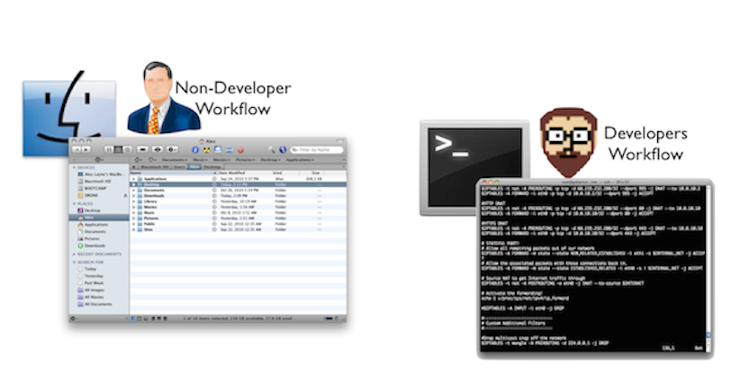

#BEWD - Working Like A Developer 

###Instructor Name

Instructors current role.

---

##Agenda

*	Intros
*	What is Web Development
*	Bash Commands
*	Using GitHub

---

##Introductions

Your course producer can help you with this.

---

##Course Administration
###Lets Get This Out Of The Way

During this course we will learn command line, Git, Ruby and Rails, in that order.

*	To pass the course: 
	*	Complete 80% of all assigned homework
	*	Complete final project

---

##Course Administration

*	What you will get from us
	* 	In class labs
	* 	Homework
	* 	Slides / student handout to be viewed in GitHub
	* 	Awesome instructor

---

##Web Development
###What is Back-End Web Development?

---

##Command Line
###Lets learn how to work like a programmer before we start to build web applications.

---

##Command Line
###Why Work Like A Developer?

*	Its faster
	*	Working with the keyboard increases your speed. The mouse slows you down.

* Its Cool!
	*	Impress your friends as you navigate the computer using your keyboard.
---

##Command Line

---

##Command Line
###How Do You Use It?

####Shell Commands.

---

##Command Line Basics

---

## Command Line Basics Exercise

---

##Terminal
###Join The Developer Club

*	You are now one of the cool kids. 
	*	Keep practicing and see the cheat sheet in the handout for a list of common commands.

---

##Git

---

##Git
###What Is GIT?

---

##Git
###Why Use GIT?

*	Confident Changes
*	Checkpoints
*	File recovery 

---

##Git Basics

---

##GitHub
###What is GitHub?

*	Is Git the same as GitHub?

---

##GitHub
###FORKS

---

##Git In Class

---

## Git It Together

---

## Homework

*	Review command line and GitHub.
*	Create your first blog entry.

---