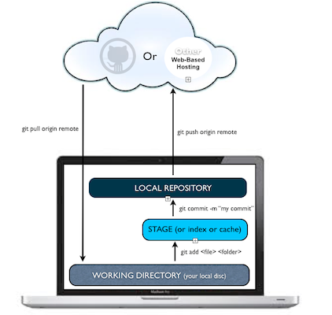

#BEWD - Working Like A Developer

###Instructor Name

Instructors current role.

---


##Agenda

*	Intros
*	What is Web Development?
*	Bash Commands
*	Using GitHub

---


##Introductions

Your course producer can help you with this.

---

##Course Administration
###Lets Get This Out Of The Way

During this course we will learn (at a high level):

* Command Line / Terminal
* Git and GitHub
* Ruby programming language
* Rails web application framework
* (Basic) Database Modeling


To pass the course you will need to:
* Complete at least 80% of all assigned homework
* Complete a final project

---

##Course Administration

*	What you will get from us
	* 	In class labs
	* 	Homework
	* 	Slides / student handouts available in GitHub
	* 	Instructor & TAs!

---

##Web Development
###The Web Application Stack


---

##Web Development
###Back-end vs Front-end Development

Let's define a few terms:

* _Web Development_ -> apps built for the web
* _Front-End Development_ -> client / browser code (HTML, CSS, JS)
* _Back-End Development_ -> server-side code (Ruby, C#.NET)

---

##Work Like a Developer
###Integrate into the developer community

* Choose the right OS, editors, & tools for your projects.
* Leverage the online community's vast libraries and documentation.
* Spread the knowledge you gain, and give back to the community when you can.
* Take pride & and joy in what you work on.
* Be efficient:
  * Use the keyboard as much as possible
  * If you find yourself doing the same thing repeatedly, automate it

---

##The Command Line
###What is it?

The command line is a terminal giving you direct access to your operating system. You can enter simple commands to perform a variety of functions.

Many of the tasks we need to carry out (such as committing our code) are best performed in the command line.

---

##The Command Line
###How do I start?

For Macs:

* Open the "Terminal" app
* For a better experience, download and install "iTerm 2", which is a replacement app that is slightly better.


For Windows:

* Open the "Command Prompt" application
* For a better experience, try "Console" (http://sourceforge.net/projects/console/)

---

##The Command Line
###Why are we using it?

* In order to learn Ruby without Rails, we must learn how to run Ruby programs on their own.
* To do so, we can simply create "stand-alone" Ruby applications.
* A stand-alone Ruby app consists of one or more Ruby files (files that have a .rb extension)
* Once you have written a Ruby file, you can run the file by typing:
	* ```ruby file.rb``` (this would run a Ruby file named file.rb)
* This is the basis of how we will be writing and testing our Ruby applications in the initial portion of this course

---


##Command Line Basics

---


##Command Line Basics Exercise

---

##Git
###What Is Git?

* Git is a source control management tool.
* Git allows you to store and update your code in a structured way.
* Git includes history of changes you make, so you can create "checkpoints" and track your work better over time.
* Git is an intelligent tool, and does many things for you automatically, but can be tricky to use in some cases. It takes a bit of learning to get fully comfortable with Git.

---

##Git
###What is GitHub?

* GitHub is a service that lets you host Git repositories in the cloud.
	* In other words, they are hosted remotely by GitHub, and can be downloaded from / uploaded to over the internet.
* GitHub allows you to easily distribute code to others by sharing your repository.
* GitHub lets you view your code online easily with a web interface.
* GitHub is free to use as long as you make your code public.
	* Private repositories cost a monthly fee.

---

##Git
###Git + GitHub Workflow Diagram



---


##Git Basics

---


##GitHub
###What is a GitHub fork?

* As you work on projects in this class, we want you to use GitHub.
* To gain easy access to all the class files, you will check out the class GitHub repository on your machine.
* In order to ensure that changes you make for your projects do not mix with other students work, you will create a *fork* of the class GitHub repository.
* You will then make changes to your fork, and occasionally pull down changes from the origin class repository.

---

##GitHub
###GitHub Forks Diagram


---


##Git In Class

---


## Git It Together

---


## Homework

*	Review command line and GitHub.
*	Create your first blog entry.

---
