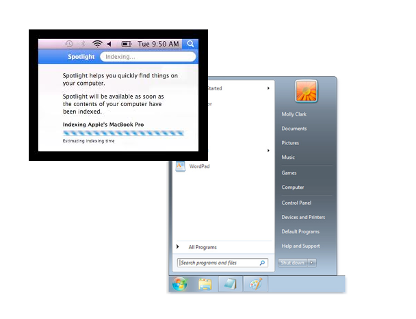
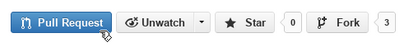

#BEWD - Working Like A Developer 

###Instructor Name

Instructors current role.

---


##Agenda

*	Installation
*	Intros
*	Bash Commands
*	Using GitHub

---


##Installation
###Terminal

Before we get started lets make sure everyone is ready to go. We will introduce ourselves while your computer installs 

Macs:- Open Terminal (spotlight type terminal)
	type: ruby -v: should see ruby 2.0.0
	
PCs:- Open command line. Start => run => type cmd
	type: 

If you do not see the above lines run this code:

---


##Introductions
Instructors choose your ice breaker

---


##Command Line


---


##Command Line
###Why Work Like A Developer?
*	Its faster
	*	Working with keyboard increases your speed. The mouse slows you down.
	*	You are always typing when coding, staying in the environment is faster.

*	Efficient Workflow
	*	You can create shortcuts and scripts so the computer does some of the work for you.

* Its Cool!
	*	Impress your friends as you navigate the computer by only using your keyboard.
---


##Command Line
###What And Where Is It?



---


##Command Line
###How Do You Use It?

*	Shell Commands.
	*	[List Of Commands]()

---


##Command Line Basics

---


## Command Line Basics Exercise
---


##Terminal
###Join The Developer Club

*	You are now one of the cool kids. 
	*	Keep practicing and see the GA cheat sheet for now you should know
		*	cd, ls, rm, mkdir

---


##GIT


---


##GIT
###What Is GIT?


<!-- or (../Slide_assets/GitHub/GIT_Drawing.png) -->

---


##GIT
###Why Use GIT?

*	Confident Changes
*	Checkpoints
*	File recovery 


---


##Git Basics

---


##GITHUB
###What is GitHub?

*	Is Git The Same as GitHub?


---


##GITHUB
###FORKS


---


##Git In Class

---


##GITHUB
###Using Git For Homework


---


## Git It Together

---


## Homework

-	Write about your first BEWD class in your blog

---


## Resources
Class is Over, but here is some extra resources.

Lesson 1: Command Line Basics & Git
========

##Cheat Sheet

The terminal (command prompt on Windows) is the developer way of navigating your computer. You are probably used to using the graphical interface provided (Finder on a mac and MyComputer on Windows).

Here is a quick reference for some of the most common commands you will use in this class. 
Remember when you see ```“$”``` or ```“C:\>”``` in these notes that is the prompt, don’t type it.

 		$  MAC
		C:\>  WINDOWS
####Navigation


How do I get into a folder?

  		$cd folder_name
		C:\> cd folder_name

Use quotation marks if your folder name has spaces.

How do I get to the parent folder?

		$cd ..
		C:\> cd ..

How do I see what is in the folder?

		$ls
		C:\> dir


How do I know what folder I am in?

		$pwd
		C:\> cd

How do I create a new folder?

		$mkdir folder_name
		C:\> mkdir folder_name


####Deleting - (Proceed With Caution)
```
How do I delete a folder?

		$rm -r folder_name
		c:\> rmdir folder-name

How do I delete a file?
		
		$rm -f file_name
		C:\> del file_name

How do I move a file?

	$mv file_name folder_name
	C:\> move file_name folder_name
The file is removed from the old location and moved to the new one.

You can rename a file the same way

		$mv old_name new_name
		C:\> move old_name new_names


##Tips & Tricks

__How is my instructor moving so fast?__

We hire wizards from Hogwarts to teach our courses. Just kidding they’re using shortcuts in the command line. 

Here are some to help you keep up:

**Tab Completion**: Press Tab to complete folder and file names                                                       

**Control + a**: Go to the beginning of the line                                                                      

**Control + e**: Go the the end of the line                                                                      

**Option + b**: Move back one word

**Option + f**: Move forward one word

**Up/Down Arrow Keys**: Repeats previous commands                                                               

**Control + w**: Delete last word typed

**Control + u**: Delete last line typed

**Control + y**: Paste last deleted item

**Control + l**: Clear the screen         


##Git Pictures


Fork Button





##Still Feel Lost? 
###Catch Up With These Resources

-	[GitHub Cheat Sheet](https://na1.salesforce.com/help/doc/en/salesforce_git_developer_cheatsheet.pdf)

-	[Intro to Git Videos](http://git-scm.com/videos)

-	[Intro to Git Tutorial](http://www.codeschool.com/courses/try-git) from Code School.