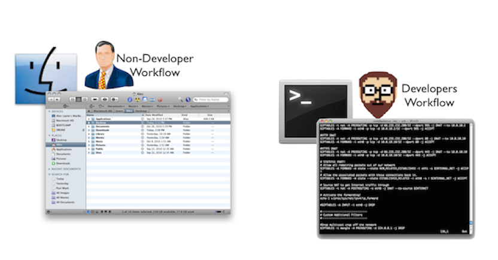
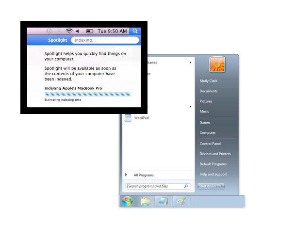
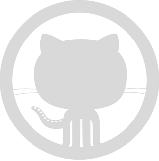
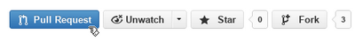

#BEWD - Working Like A Developer 

###Instructor Name

Instructors current role.

---


##Agenda

*	Install
*	Intros
*	What is Web Development
*	Bash Commands
*	Using GitHub

---


##Installation
###Terminal


This class is using Ruby 2.0 and Rails 4.0. 

We are still putting together instructions for both PCs and MACs. 

For now please have students install using your preferred method.

---


##Introductions
Instructors choose your ice breaker

---

##Course Administration
###Lets Get This Out Of The Way

During this class we will learn command line, Git, Ruby and Rails, in that order.

*	To pass the course: 
	*	Complete 80% of all assigned homework
	*	Complete final project

---

##Course Administration

*	What you will get from us
	* 	In class labs
	* 	Homework
	* 	Slides / student handout to be viewed in GitHub
	* 	Awesome instructor

---


##Web Development
###What is Back-End Web Development?

---


##Command Line
###Lets learn how to work like a programmer before we start to build web applications.


---


##Command Line
###Why Work Like A Developer?

*	Its faster
	*	Working with the keyboard increases your speed. The mouse slows you down.

* Its Cool!
	*	Impress your friends as you navigate the computer using your keyboard.
---


##Command Line



---


##Command Line
###How Do You Use It?

####Shell Commands.

---


##Command Line Basics

---


## Command Line Basics Exercise

---


##Terminal
###Join The Developer Club

*	You are now one of the cool kids. 
	*	Keep practicing and see the cheat sheet in the handout for a list of common commands.

---


##Git


---


##Git
###What Is GIT?


---


##Git
###Why Use GIT?

*	Confident Changes
*	Checkpoints
*	File recovery 


---


##Git Basics

---


##GitHub
###What is GitHub?

*	Is Git the same as GitHub?



---


##GitHub
###FORKS


---


##Git In Class

---


## Git It Together

---


## Homework

-	Create a blog to document your experience
-	Write about your first BEWD class in your blog

---


<div id="resources">
## Resources: Command Line Basics & Git

Class is over, but here are some extra resources.

##Cheat Sheet

The terminal (command prompt on Windows) is the developer way of navigating your computer. You are probably used to using the graphical interface provided (Finder on a mac and MyComputer on Windows).

Here is a quick reference for some of the most common commands you will use in this class. 
Remember when you see ```“$”``` or ```“C:\>”``` in these notes that is the prompt, don’t type it.

 		$  MAC
		C:\>  WINDOWS
####Navigation


How do I get into a folder?

  		$cd folder_name
		C:\> cd folder_name

Use quotation marks if your folder name has spaces.

How do I get to the parent folder?

		$cd ..
		C:\> cd ..

How do I see what is in the folder?

		$ls
		C:\> dir


How do I know what folder I am in?

		$pwd
		C:\> cd

How do I create a new folder?

		$mkdir folder_name
		C:\> mkdir folder_name


####Deleting - (Proceed With Caution)

How do I delete a folder?

		$rm -r folder_name
		c:\> rmdir folder-name

How do I delete a file?
		
		$rm -f file_name
		C:\> del file_name

How do I move a file?

		$mv file_name folder_name
		C:\> move file_name folder_name
The file is removed from the old location and moved to the new one.

You can rename a file the same way

		$mv old_name new_name
		C:\> move old_name new_names


##Tips, Tricks & Motivation

__How is my instructor moving so fast?__

We hire wizards from Hogwarts to teach our courses. Just kidding they’re using shortcuts in the command line. 

Here are some to help you keep up:

**Tab Completion**: Press Tab to complete folder and file names                                                       

**Control + a**: Go to the beginning of the line                                                                      

**Control + e**: Go the the end of the line                                                                      

**Option + b**: Move back one word

**Option + f**: Move forward one word

**Up/Down Arrow Keys**: Repeats previous commands                                                               

**Control + w**: Delete last word typed

**Control + u**: Delete last line typed

**Control + y**: Paste last deleted item

**Control + l**: Clear the screen        
 


##Git Diagrams and Pictures

Fork Button


Pull Request Buttons




##Still Feel Lost? 
###Catch Up With These Resources


-	[Command Line Crash Course](http://cli.learncodethehardway.org/book/)

-	[GitHub Cheat Sheet](https://na1.salesforce.com/help/doc/en/salesforce_git_developer_cheatsheet.pdf)

-	[Intro to Git Videos](http://git-scm.com/videos)

-	[Intro to Git Tutorial](http://www.codeschool.com/courses/try-git) from Code School.
