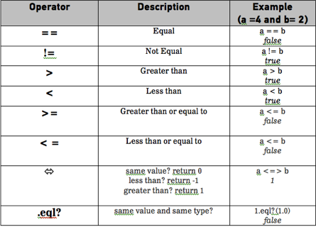
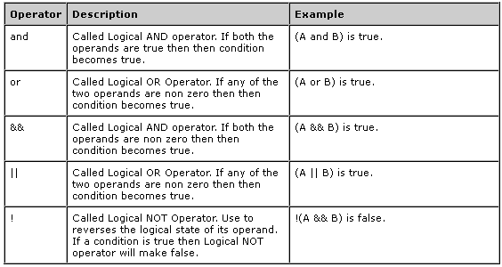

#BEWD - Variables and Conditional Logic

###Instructor Name

---


##Agenda

*	Quiz
*	Intro to Ruby & irb
* 	Variables
	* 	Numbers
	*	Strings
	*	Booleans
* 	Method Basics
* 	Conditional Logic
* 	Lab Time

---

##QUIZ
1.	How do I change directories using the command line?
2.	What is Git and GitHub?
3.	How do I add files to git?
4.	What is a GitHub Repository?
5.  What is the correct way to push changes to your GitHub repo?
	a. git pull origin master
	b. git commit -m "push to GitHub"
	c. git push origin master

---

##Ruby
###A programming language

*	An open source programming language
*	Easy to read and natural to write
*	Created by Yukihiro Matsumoto (aka Matz) with the goal of building a language FOR developers
*	Regularly maintained and evolved (recently reached version 2.0.0)

<div style="text-align:center;">
  
</div>

---

##Rails
###A web application framework

*	Open source web application framework that is built in Ruby
*	Allows you to create web applications that query a database.
*	Created by DHH (David Heinemer Hansson) to simplify the task of building web applications, with the help of _conventions_

<div style="text-align:center;">
  
  
</div>


---


##Ruby & Rails
###Ruby first.

*	It will be easier to navigate a Rails project once we have a basic understanding of Ruby.
*	We will first teach you how to write simple Ruby scripts as stand-alone applications
*	Once we have become familiarized with Ruby, we will start building Rails applications (which are essentially groups of Ruby script files that work together)

---

##Computational Thinking
###What does it mean to program?

"Learning about “for” loops is not learning to program, any more than learning about pencils is learning to draw."

 –Bret Victor, Learnable Programming

---


##Robot


---

##Robot Recap
###Its about changing how you think
*	Think in logical steps to solve a problem
*	Use Ruby keywords to help solve those problems
	*	Conditional Logic
	*	Iteration
	
---

##Programming Fundamentals
* In order to start writing our own Ruby programs, we need to learn some of the basic fundamental tools
* Specifically, we need to learn:
	* Variables
	* Methods
	* Conditions
* We will first learn the basics on their own, and then try to apply our skills in a simple interactive Ruby script

---


##Saving Values
### Using Variables

* We can tell our program to remember values for us to use later on
* The action of saving a value to memory is called **assignment**
* The entity we use to store the value is called a **variable**
* The action of getting the value from a variable is called **accessing** the variable
* We will use all the above techniques to store values into variables, and generate new values using existing variables

---


##Variables
###Storing Values

	>> name = "Steven"
	 => "Steven"
	>> age = 2013 - 1983
	 => age # 30
---

##Data Types

* The types of different values we support include numbers, text, and other more complex ones we'll see in the future
* Ruby has its own names for these:

		1						#Fixnum
		1.99					#Float
		'Hi! String here!' 		#String
		"I'm a string tool"		#String

---


##Variables

Let's learn how to assign and access simple integer and string variables

---


##Saving Code
###Using Methods

* The same way we can store VALUES in memory by using variables…
* We can store CODE in memory by using methods.
* In other words, we can train the program to 'remember' a set of commands, and give that set of tasks a command name
* Then, we can call that command by name and the program will perform those tasks

---

##Math in Ruby
###Ruby Arithmetic Operators


---


##Methods

Let's learn how to call simple methods, and how to declare our own methods.

---

##Methods
###Recap

* Methods let us train the program to 'remember' a set of code to perform later
* Making a new method is called **declaring** a method
* Declaring a method does NOT run the method immediately
* If the method takes in variables to use while it is doing its tasks, those are called **parameters**

---


##Teddit - Strings

Teddit is a news aggregator we will build during this course.

---


##More Data Types
###Booleans 

* Besides strings and integers, Ruby also has a Boolean data type
* A boolean is a simple value that is either ```true``` or ```false```
* When different data types are compared to each other, the result of that comparison is a boolean result (e.g. 5 < 7 => true)

---


##Boolean
###Logic Operators





---


##Booleans

---


##Variables & Data Types
###Recap 

Data Types

*	Number
*	Float (number with decimals)
*	String
*	Booleans

Variables

*	Store values
*	Can be passed to methods as parameters

---

##Conditional Logic
###Decision Time 

It's either TRUE or FALSE (like booleans)

If you are greater than 18 
you are an adult

	if age > 18
		puts "You are an adult"
	end

---


##Conditional Logic
###Multiple Conditions


	guess = 7 
	if guess > 5
		puts "Too high!"
	elseif guess < 5
		puts "Too Low!"
	else
		puts "You've guessed my hidden digit!"
	end

---

##Conditional Logic
###Multiple Conditions



---


##Lab Time
* 	Conditional Teddit

---


## Homework
###Secret Number

Let's see a demo of Secret Number

*	HW 1 - Secret Number
	*	Secret number is a game we will incrementally build for homework during the Ruby portion of the course. 
		Players must guess a secret number and your program will provide feedback. 
---

