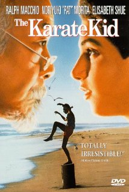
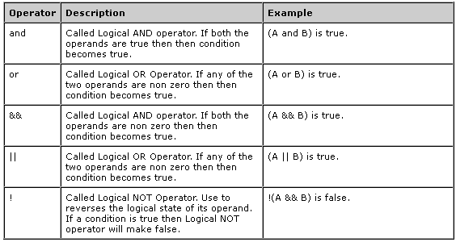

#BEWD - Variables and Conditional Logic

###Instructor Name

Instructors current role.

---


##Agenda


*	Quiz
*	Intro to Ruby & Using irb / pry
* 	Variables
	* 	Numbers
	*	Strings
	*	Booleans
* 	Intro To Methods
* 	Conditional Logic
* 	Lab Time

---

##QUIZ
1.	How do I change directories using the command line?
2.	What is Git and GitHub?
3.	How do I add files to be committed using git?
4.	What is a GitHub Repository?
5.  What is the correct way to push changes to your GitHub repo?
	a. git pull origin master
	b. git commit -m "push to GitHub"
	c. git push origin master

---

##Ruby & Rails
###Ruby

*	An open source programming language
*	Created by Yukihiro Matsumoto aka Matz
*	Natural to read and easy to write

###Ruby on Rails

*	Open source web application framework runs on Ruby
*	Allows you to create web applications that talk to and query a database.


---


##Ruby & Rails
###We learn Ruby first.

*	It will be easier to navigate a Rails project, once we have a basic understanding of  Ruby.


<div id ="resources"> 
[Wax on Wax Off](http://www.youtube.com/watch?v=8aYl7N0JPWs)
</div>

---


##Ruby & Rails
###Ruby Keywords

*	The vocabulary you will need to speak Ruby language: 

ENCODING break case ensure false or redo undef unless FILE LINE class 
def loop for if rescue retry until when BEGIN END alias and begin
defined? do else elsif end in module next nil not return self super then true while yield

###This is it!

---


##IRB / PRY

---


##Math in Ruby
###Ruby Arithmetic Operators


---


##Computational Thinking
###What does it mean to program?

"Learning about “for” loops is not learning to program, any more than learning about pencils is learning to draw."

 –Bret Victor, Learnable Programming

---


##Robot


---


##Robot Recap
###Its about changing how you think
*	Think in logical steps to solve a problem
*	Use Ruby keywords to make programs more efficient
	*		Conditional Logic
	*		Iteration
---


##Some Tools To Help Us Think…

---


##Variables
###Store Values

		name = "Steven"
		=> name # "Steven"
		age = 2013 - 1983
		age # 30
---


##Data Types

		1.class 					#Fixnum
		1.99.class					#Float
		'Hi! String here!'.class 	#String
		"I'm a string tool".class	#String


--


##Teddit - Strings

Teddit is a news aggregator we will build during this class.

---


##Variables
### Getting Info From Users

		puts "Can you help me with these groceries?"
		response = gets
		=> program waits for you to type your response
		
---


##Teddit Strings

Hint: Get familiar with using google to look up syntax.
If you are stuck on syntax write down the steps in English. Let's focus on thinking like a programmer.

---


##Data Types
###Booleans 

Its' either TRUE or FALSE

---


##Boolean
###Logic Operators


---


##Booleans

---


##Variables & Data Types
###Recap 

Data Types

*	Number
*	String
*	Booleans

Variables

*	Store values 
*	Values can change
*	Can be passed to methods.


---


##Methods

---


##Methods
###Keeps your code DRY

* 	Groups your program logic together so you don't have to repeat yourself. 
* 	Can pass variables to methods

		
		def say_hello_to(name)
			puts "Hi #{name}"
		end
		
		say_hello_to "John" #outputs: Hi John

----

##Conditional Logic
###Decision Time - Conditionals 

Its' either TRUE or FALSE (like booleans)

If you are greater than 18 
you are an adult

	if age > 18
		puts "You are an adult"
	end

---


##Conditional Logic
###Multiple Conditions

Its' either TRUE or FALSE

	guess = 7 
	if guess > 5
		puts "Too high!"
	elseif guess < 5
		puts "Too Low!"
	else
		puts "You've guessed my hidden digit!"
	end

---

##Conditional Logic
###Multiple Conditions



---


##Lab Time
* 	Conditional Teddit

---


## Homework
###DEMO - Secret Number.

*	HW 1 - Secret Number
	*	Secret number is a game we will incrementally build for homework during the Ruby portion of the course. 
		Players must guess a secret number and your program will provide feedback. 
---


## id="resrouces" RESOURCES
Class is over, but here are some extra resources.


Lesson 2: Variables, Conditionals and Methods
=========


##Cheat Sheet

__Variables__


 ```ruby
 real_name = "Bruce Wayne"
 secret_identity = "Batman"
 ```

*String interpolation aka Adding Variables to String*

```ruby
puts "We just spilled the beans #{real_name} is #{secret_identity}"
```

> We just spilled the beans Bruce Wayne is Batman

__Arithmetic Operators__

| Operator        | Description           | Example (a = 4 and b = 2)  | Output |
| ------------- |:-------------| :-----|:-----|
| ```+```      | Addition (add left to right, give result) |  ```puts a + b```  | 6 |
| ```-```      |  Subtraction (subtract left from right, give result)    |  ```puts a - b```  | 2 |
| ```*``` | Multiplication (multiply left by right, give result)   | ```puts a * b```  | 8 |
| ```/``` | Division (divide left by right, give result)  | ```puts a / b``` | 2 |
| ```%``` | Modulus (divide left by right, give remainder) | ```puts a % b```  | 0 |
| ```**``` |Exponent (multiply left by left, right times, give result)  | ```puts a ** b``` | 16 |


__Conditionals Operators__

| Operator        | Description  | Example         (a = 4 and b = 2)  | Evaluated As |
| -------------   |:-------------| :-----|:-----|
| == | Equality |  a == b | false |
| != |  Not Equal | a != b | true  |
| >  | Greater than | a > b | true  |
| < | Less than |a < b | true  |
| >= |Greater than  or equal to | a <= b | false |
| <= |Less than or equal to | a <= b | false |
| <=> |Same value? return 0, less than? return -1, greater than? return 1 | a <=> b | 1 |
| .eql? | same value and same type?| 1.eql?(1.0)| false |

__If Syntax__

```ruby
if (condition)
  code to execute if the condition is true
end
```

```ruby
if var == 20
   puts "Variable is 20"
end
```

__If Else Syntax__

```ruby
if var == 20
   puts "Variable is 20"
else
   puts "Variable is another number"
end
```

__If Else If Syntax__

```ruby
if var == 20
   print "Variable is 20"
elsif var == 30
   print "Variable is 30"
else
   print "Variable is something else"
end
```

__Methods__

__Simple Methods__

```ruby
def method_name
end
```

__Method w/ Parameters__

```ruby
def say (something)
      puts "They said #{something}"
end

 say ("Hello")```

=> They said Hello


__Running .rb from the terminal__

	ruby file_name.rb

##Tips, Tricks and Motivation

- What is Programming [video](http://www.youtube.com/watch?v=YCDTYlUWkQE)
- Using Sublime Text 2 [video tutorial](https://tutsplus.com/course/improve-workflow-in-sublime-text-2/)
- [Tricked Out Sublime Text](http://net.tutsplus.com/tutorials/tools-and-tips/sublime-text-2-tips-and-tricks/)
-	[Learning to Program](http://worrydream.com/LearnableProgramming/)


##Still Feel Lost? 
###Catch Up With These Resources

- Intro to Ruby [tutorial](http://www.codeschool.com/courses/try-ruby) from Code School for beginners to wrap your head around programming concepts.
-	Beginner Ruby [Tutorial](- http://www.codecademy.com/courses/ruby-beginner-en-d1Ylq?curriculum_id=5059f8619189a5000201fbcb)
-	Book [chapter](http://ruby.bastardsbook.com/chapters/ifelse/) on conditionals.
- [Article](http://ruby.about.com/od/control/a/Conditional-Statements.htm) from about.com about ruby conditional statements.
- [Article](http://strugglingwithruby.blogspot.com/2008/11/conditional-statements.html) - More about true and false.
- [Khan academy tutorial](https://www.khanacademy.org/math/geometry/logical-reasoning/e/conditional_statements_and_truth_value) about logical reasoning.
