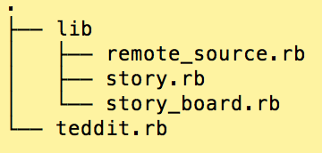

##Teddit Objects

*	Pair Program!
*	When you run teddit.rb this file is executed first.
	*	The lib folder contains the RemoteSource class, StoryBoard and Story class. 
	*	The spec folder is a test we added. Don't worry about it, leave as is!
	
	

###Task

*	Your job is to code the StoryBoard and Story classes.
*	Start with the teddit.rb file and follow the flow, add the necessary code to story.rb and story_board.rb to make the program run without errors. 
*	Ask yourself: Do these variables need to be class or instance variables? Do you need class or instance methods?

HINTS:

Story CLASS

*	Properties
	*	Title
	*	Category
	*	Upvotes

*	Methods
	*	Upvote
	*	Downvote

StoryBoard Class

*	Properties
	* storries array. 
	*	StoryBoard returns stories in an array in this format:
	
			Story: #{story.title}, Category: (#{story.category}), Current Upvotes: #{story.upvotes}

*	Methods
	*	add_story(story) (Takes a story object)

