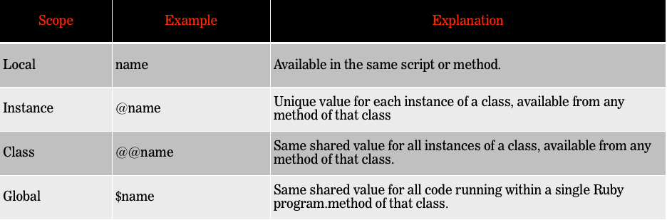

#BEWD - Classes and Objects

###Instructor Name

Instructors current role.

---


##Agenda

*	Creating Classes & Objects
*	Scope
	*	Variables Scope
	*	Method Scope
*	Lab Time	

---


##From Hashes to Classes
###Hashes pros and cons

What are some pros and cons of using hashes?

---


##Classes & Objects
###Classes to the rescue

*	What is a class?
*	What is an object
*	Why/when to use them?

---


##Creating Objects


---

##Classes & Objects
###Adding variables to a class


	# Hashes
	story = {}
	story[:title] = "Sand angry with flip-flops" 
	story[:title] #=> Returns your value
	
	
	# With an object
	class Story
  		attr_accessor :title
	end

	story = Story.new
	story.title = "Sand angry with flip-flops"
	story.title #=> Returns your value

---


##Classes & Objects
###Adding methods to our class

	class Story
  		attr_accessor :title, :category, :upvotes
  		def upvote!
    		@upvotes += 1
  		end
	end

	story = Story.new
	story.title = "Fruit Flies find fleas facetious"
	story.category = "Turf War"
	story.upvotes  = 1

	story.upvote!
	story.upvotes #=> 2

---


##Laptop

---


##Classes & Objects
###Scope

---


##Variable Scope



attr_accessor : Makes variables available outside the class.

---


##Scope


---


##Scope
###Initialize Method

*	The initialize method is called by .new (see laptop.rb for refresh)

---


##Class Variables

---


##Classes & Objects
###Side Note

*	to_s method called with puts command. 
*	It can be overwritten

		class My_Class
  			def to_s
    				puts "I turned the object into string and put it to the screen. "  			
    			end
		end

		my_object = My_Class.new
		puts my_object

---


##Scope
###Method Scope


	batman = "Dark Knight and Gotham Crime Fighter"
	
	def batman.secret
  		puts "He's Billionaire Bruce Wayne"
	end

	batman #=> Dark Knight and Gotham Crime Fighter
	batman.secret #=> He's Billionaire Bruce Wayne
	
---


##Method Scope
###Class Methods

* You don't need an instance to call a class method

		class StoryBoard
  			@@stories = []
  			def StoryBoard.add_story(story)
    			@@stories << story
  			end

  			def StoryBoard.stories
    			@@stories
  			end
		end

		StoryBoard.add_story("Ducks on a rampage")
		StoryBoard.stories #=> "Ducks on a rampage"
---


##Self


---


##Class Methods
###Knowing Self

*	self keyword allows us to do this instead of StoryBoard.add_story(story)

		class StoryBoard
  			@@stories = []

			
  			def self.add_story(story)
   	 			@@stories << story
  			end

  			def self.stories
   	 			@@stories
  			end
		end

		StoryBoard.add_story("Ducks on a rampage")
		StoryBoard.stories #=> "Ducks on a rampage"
---


##Recap
###Classes & Objects

*	Classes allow us to keep code DRY.
*	In object oriented programs variables have scope. local, @instance and @@class.
	*	attr_accessor allows a variable to be accessed outside of a method
*	We can create class methods by using self.method_name. 
	*	Class methods can be called with no object or instance. 	
---


##Classes & Objects
###Classes in separate .rb files

	
---

##Classes & Objects
###Too many classes in one .rb file.

	# blt.rb
	class BLT
  		#...
	end

	class Bacon
  		#...
	end

	class Lettuce
  		#...
	end

	class Tomato
  		#...
	end

---


##Classes & Objects
###Everyone Gets a File!

	# blt.rb
	require_relative 'bacon'
	require_relative 'lettuce'
	require_relative 'tomato'

	class BLT
  		#...
	end

	class Bacon
  		#...
	end

	class Lettuce
  		#...
	end

	class Tomato
  		#...
	end

---

##Classes & Objects
###Creating a link between classes in separate .rb file

*	require
*	require_relative (we've seen this when working with APIs)
*	$LOAD_PATH.unshift(File.dirname(__FILE__)) (use to load files in irb)

---

## Homework


*	Midterm due lesson 8. See homework folder for details.

---


##Lab Time

*	Teddit Objects (read the readme.md for instructions).
*	Secret Number

---


<div id="resources">
## RESOURCES: Classes & Objects

###Cheat Sheet

####Classes & Objects

__Create A Class__

```ruby
	class class_name
  		#variables and method for this class.
	end
```

__Creating Objects__

```ruby
	class GA_course
		def initialize (course_name)
			@course_name = course_name
		end

		def announce_course
			puts "GA has a course on #{@course_name}"
		end
	end
 
	my_course = GA_course.new("BEWD")
	other_course = GA_course.new("UXD")

	my_course.announce_course
	other_course.announce_course
```
>GA has a course on BEWD

>GA has a course on UXD


__Variable Scope__

| Scope        | Example           | Explanation  |
| ------------- |:-------------| :-----|
| Local      | name | Available in the same method |
| Instance      | @name      |   Unique value for each instance of a class available from any method in that class. |
| Class | @@name     | Same shared value for all instances of a class, available from any method of that class |
| Global | $name     | Same shared value for all code running within a single Ruby program. |


__Method Scope__

```ruby
	class GA_course
		def initialize (course_name)
			@course_name = course_name
		end

		def announce_course
			puts "GA has a course on #{@course_name}"
		end
		
		def self.announce_courses
			puts "GA has a course on BEWD"
			puts "GA has a course on FEWD"
			puts "GA has a course on CSF"
			puts "GA has a course on DAT"
			puts "GA has a course on UXD"
			puts "GA has a course on PDM"
		end
	end
	
	my_course = GA_course.new("BEWD")
	my_course.announce_course #
	GA_Course.announce_courses 
```
	
>GA has a course on BEWD

>GA has a course on BEWD
>GA has a course on FEWD
>GA has a course on CSF
>GA has a course on DAT
>GA has a course on UXD
>GA has a course on PDM

	
###Still Feel Lost?
####Catch Up With These Resources

-	What is Object Oriented Programming [video](http://www.youtube.com/watch?feature=endscreen&v=SS-9y0H3Si8&NR=1)
-	What is Object Oriented Programming [Book Chapter](http://ruby.bastardsbook.com/chapters/oops/)
-	Introduction to Objects [Ruby Monk](http://rubymonk.com/learning/books/1-ruby-primer/chapters/6-objects/lessons/35-introduction-to-objects)
-	Building your own class [Ruby Monk](http://rubymonk.com/learning/books/1-ruby-primer/chapters/7-classes/lessons/40-building-your-own-class)

