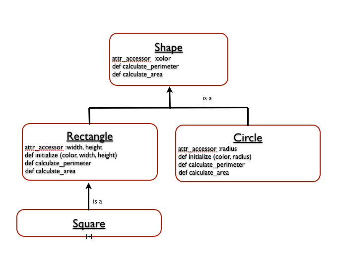
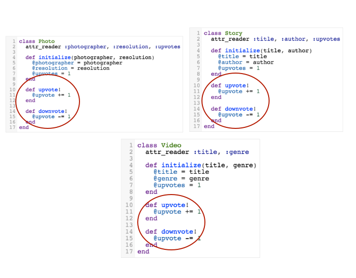
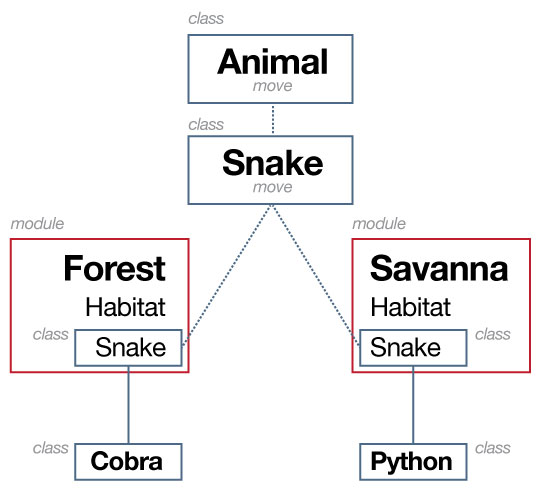

#BEWD - Sharing Behavior

###Instructor Name

Instructors current role.

---


##Agenda

*	Sharing Behavior
*	Ruby Recap
*	Lab Time

---


##Sharing Behavior
###Sharing is Caring

*	Inheritance
*	Mixins'
*	Modules

---


##Inheritance
###"I got is from my momma" - Will.i.am

*	Share properties & behavior
*	Keeps code DRY


---


##Inheritance


---


##Inheritance

---


##Inheritance
###Glimpse into Rails

*	Where you'll see it…

		class User < ActiveRecord::Base
		end


---


##Inheritance
###Recap

*	One class can inherit the capabilities of another using the ```<``` operator.
*	Sub-class inherits from super-class (child class inherits from parent class)
*	A child can override a parent variable or method by re-using its name
class. 


*	If defined in different physical files, a child must require its parent

---


##Sharing Behavior
###Getting Ready For Rails

*	The following slides introduce other ways to share behavior. 
*	This is an introduction and we will see more when we start Rails. 
*	For now lets understand the basics. 


---


##Sharing Behavior
###Mixins


---

##Mixins
###When inheritance doesn't work.

*	What if our classes don't have an "is a" relationship.


---

##Mixins
###Teddit as an example

*	Lets say teddit now accepts photos, videos and stories. 




*	You can up and down vote all of them.


---


##Mixins
	module Upvotable
		def upvote!
    		@upvote += 1
    	end
    	
    	def downvote!
    		@upvote -= 1
    	end
	end

	
	class Photo
		attr_reader :photographer, :resolution, :upvotes
		include Upvotable
		
		def initialize(photographer, resolution)
    		@photographer = photographer
    		@resolution = resolution
    		@upvotes = 1
    	end
	end

	class Story
		attr_reader :title, :author, :upvotes
		include Upvotable
		
		def initialize(title, author)
    		@title = title
    		@author = author
    		@upvotes = 1
    	end
    end

---


##Sharing Behavior
###Include vs Require

*	What's the difference?

---


##Sharing Behavior
###Modules

*	What if we wanted to have two bat classes. 

		class Bat
			def fly!
				puts "So free.. and blind"
			end
		end

		# Somewhere else in your code
		class Bat
			def made_of
				"wood"
    		end
		end

		slugger = Bat.new
		slugger.fly?!??!

---


##Modules
###Namespace It


	module Animal
		class Bat
			def fly!
				puts "So free.. and blind"
    		end
    	end
	end

	Animal::Bat.new

	module BaseballUtensils
		class Bat
    		def made_of
      			"wood"
    		end
    	end
	end

	BaseballUtensils::Bat.new

---


##Modules
###Namespace It




---


##Ruby
###Recap

*	You're set and ready to start rails. 

---


##Lab Time

*	Midterm
*	Secret Number

---


## Homework

*	Midterm due lesson 8.

---

<div id="resources">
## Resources: Sharing Behavior

Good code should be reused!

###Cheat Sheet

####load vs. require vs. include

Why do they all sound the same??!!!!

*	load: inserts a file's contents
	*	File can be loaded more than once.

		```load 'config.rb'```

*	require inserts parsed contents: We use it to require a class in another .rb file.
	*	File is only required once.

		```require 'config'```

*	include 'mixes in' modules. Use to include modules and mixins.
		
		```include 'my_module'``` 

####Inheritance
*	One class can inherit the capabilities of another using ```<``` 
*	Sub-class inherits from super-class 
(child class inherits from parent class)

*	If defined in different physical files, a child must require its parent

-- lib/person.rb ---

```ruby

	class Person
	end


```

--- lib/worker.rb ---

```ruby

	
	require 'lib/person'

	class Worker < Person
	end

```


Heres a lengthy example: 

*	Don't repeat yourself (DRY)
*	Don't do this!


```ruby

	class ScienceSubteddit
  		@@name = "Science"
  		@@description = "Where we blow stuff up for fun"
  		def self.welcome
    		puts "Welcome to the #{@@name} Subteddit!"
    		puts @@description
  		end
	end

	class MoviesSubteddit
  		@@name = "Movies"
  		@@description = "Because the Matrix was awesome"
  		def self.welcome
    		puts "Welcome to the #{@@name} Subteddit!"
    		puts @@description
  		end
	end

	class SportsSubteddit
  		@@name = "Sports"
  		@@description = "We have big muscles and we run fast"
  		def self.welcome
    		puts "Welcome to the #{@@name} Subteddit!"
    		puts @@description
  		end
	end

	class RubySubteddit
  		@@name = "Ruby"
  		@@description = "Because Python Sucks"
  		def self.welcome
    		puts "Welcome to the #{@@name} Subteddit!"
    		puts @@description
  		end
	end
```


*	This is a better approach and demonstrates the benefit of using Object Oriented programming. 
	*	News sections inherit from Subteddit.


```ruby
	class Subteddit
  		@@name = ""
  		@@description = ""
  		def self.welcome
    		puts "Welcome to the #{@@name} Subteddit!"
    		puts @@description
  		end
	end

	class ScienceSubteddit < Subteddit
  		@@name = "Science"
  		@@description = "Where we blow stuff up for fun"
	end

	class MoviesSubteddit < Subteddit
  		@@name = "Movies"
  		@@description = "Because the Matrix was awesome"
	end

	class SportsSubteddit < Subteddit
  		@@name = "Sports"
  		@@description = "We have big muscles and we run fast"
	end

	class RubySubteddit < Subteddit
  		@@name = "Ruby"
  		@@description = "Because Python Sucks"
	end
```

####Mixins

*	Include a module in a class to access the module's methods. This also keeps code DRY.

```ruby

	module MyModule
  		def module_method(parameters)
    		return parameter
  		end
	end
```

```ruby

	class MyClass
		include MyModule
	end


	my_object = MyClass.new
	my_object.module_method
```
####Modules

Ruby exposes much core functionality through modules

A commonly used built in module is Math
The :: operator is used to refer to a constant set in a module

```ruby

	puts Math.sqrt(9)

```


>3.0


```ruby

	puts Math::PI
```

>3.1415926


*	A module is like a class, except 
	*	You cannot create a new instance of a module
	*	You cannot extend a module to create a child module


*	Modules are a way to add namespaces


Ruby docs have a full list of available modules.


###Still Feel Lost? 

Its ok, we will see these terms again in Rails, but you can also,

####Catch Up With These Resources

*	Working with Enumerables [Video](http://vimeo.com/gatv/review/67752032/67e8f877bb)
	*	password => BEWD_GA	
*	[Modules](http://marakana.com/bookshelf/ruby_tutorial/modules.html
)
*	[Mixins](http://samwho.co.uk/blog/2011/09/12/ruby-mixins/)


