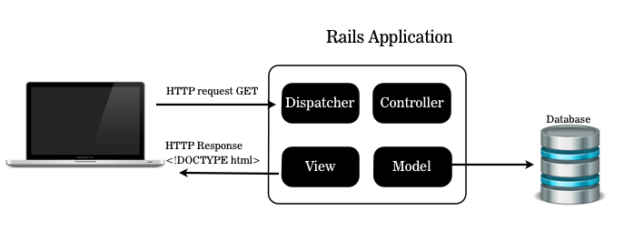
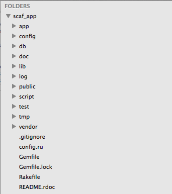

#BEWD - My First Rails App

###Instructor Name

---


##Agenda

*	Intro To Rails
*	Rails & My Browser
*	Structure Of A Rails App
*	Getting Ready With Rails 4
*	Scaffold Application
*	Lab Time

---


##Rails
###A bit about Rails

Rails is an open source web framework written in Ruby.

Created by David Heinemeier Hansson (@dhh) in 2004 as an extraction of the reusable components of Basecamp.

---


##Rails
### Framework defined

Rails is a framework for building websites.

It solves the most common problems faced when building websites.

---


##Rails
###Websites built on Rails

*	Groupon
*	GitHub
*	Hulu
*	Funny or Die
*	__General Assembly__

See more [here](http://www.developerdrive.com/2011/09/20-best-sites-built-with-ruby-on-rails/)

---


##Rails & My Browser
###The Internet

*	To understand Rails we need to understand the Internet.

---


##Draw The Internet

*	Get into groups of 2-3.
*	Draw a diagram that represents your understanding of how the Internet works. Here are a couple of questions to consider as you draw.
	*	What happens when you hit enter on your address bar?
	*	Where does a website live?

We will discuss how the internet works at a high level next.

---


##Rails & My Browser
###The Internet


---


##Rails & My Browser
###The request/response cycle

*	HTTP (the protocol that drives the Web) communicates via input/output just like the terminal.

*	Browsers send input (the request) and the server returns output (the response).



---


##Rails 4
###Are You Ready?

	$	gem install rails --version 4.0.0 --no-ri --no-rdoc
	$	rails -v


* If you don't see version 4 returned, raise your hand

---


##Scaffold Books

---

##Structure Of A Rails App
###my_first_rails_app




*	Most of your application logic belongs to app/ (including css and javascript files)

*	public/ contains static files that are directly available

---

##Structure Of A Rails App
### The app folder

Most of the code we write belongs somewhere in the `app` folder.

* `app/assets`: CSS, JavaScript and images used in templates.
* `app/controllers`: Classes which gather data and render responses for specific
  requests.
* `app/helpers`: Utility modules which define methods for templates to use.
* `app/mailers`: Classes that define various outbound emails in your app.
* `app/models`: Classes defining your data models (e.g.. User, Comment, Post).
* `app/views`: Templates called by your controllers to render HTML.
* `app/views/layouts`: Master templates to be used throughout your website.

More about app structure in following class.

---

##Recap
###Make an app

	$ rails new my_app_name
	$ ls
	$ cd my_app_name

---


##Recap
###Create The Table(s)

	$ rake db:migrate

---

##Recap
###Start The Server

	$ rails s

* Go to localhost:3000/books in browser

---

##Recap
###Scaffolding

	$ rails generate scaffold Book author:string title:string abstract:text

*	Scaffolds provide the bare necessities for creating, editing, deleting, and viewing a resource. Otherwise known as CRUD.
*	Scaffolds are great when getting started with Rails or a new app, but are generally not used in production websites.
*	Scaffolding is not considered best practice, and should generally only be used initially as a means of learning (the primary drawback of using them is that you generate lots of code that you don't need, and it's difficult to undo).

---


##Hosting Public Files
###Rails can be a simple file server too!

Add a static file to the 'public' folder.

* Create the file `public/hello.txt`
* Start your server with `$ rails s`
* Visit http://localhost:3000/hello.txt

---


## Homework

Final project proposal - Due Lesson 9

---


##Lab Time

*	Create a new application called User_Scaffold.
*	The resource should be `User` and it should have the attributes:
	*	First Name
	*	Last Name
	*	Age
	*	Email

__BONUS!__ Remove the ability to edit after a user has been created

_Hint:_ app/views

---


<div id="resources">
##Resources: My First Rails Application

###Cheat Sheet

####What is a Framework?


...a software framework is an abstraction in which software providing generic functionality can be selectively changed by additional user written code.

&dash; via Wikipedia
You use libraries, frameworks use you.

####Creating a new Rails app

```bash
$ rails new app_name
```

*   This will create a project folder and some useful files for you.
*   Don't forget to cd into your new directory before you move on.

####Running the server.

```bash
$ rails server
```

* Now you can visit http://localhost:3000/ and see your app.


###Tips & Tricks

* [Learn how to use your browser for web development](http://discover-devtools.codeschool.com/)

###Still Feel Lost?

This lesson we really want you to have a general understanding of how the internet works. Here are some resources to help you dive deeper and review what you learned in class.

####Catch Up With These Resources

* [Article](http://computer.howstuffworks.com/internet/basics/internet.htm) by How Stuff Works.
* Five minute [video](http://www.youtube.com/watch?v=7_LPdttKXPc) on how the internet works.
* A lengthy [chapter](http://www.stanford.edu/class/msande91si/www-spr04/readings/week1/InternetWhitepaper.htm) from standford.edu.


