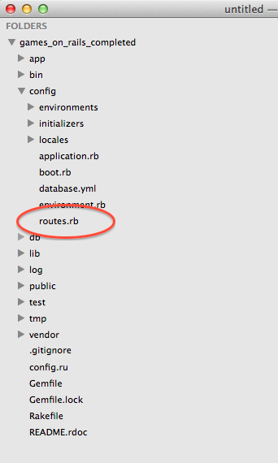
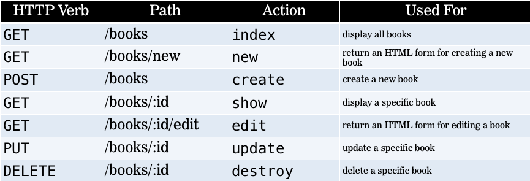
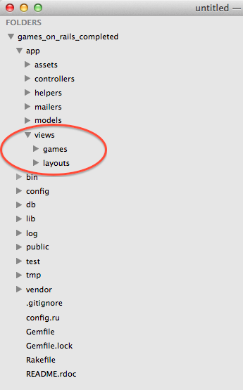
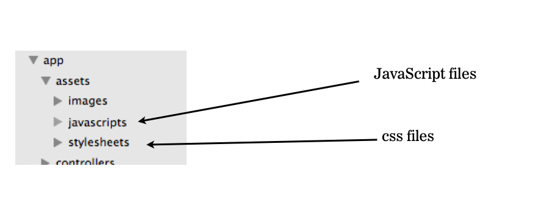

#BEWD - Routes, Controllers & Views

###Instructor Name

---


##Agenda

Learning Objective: Understand flow of control in a Rails app.

*	Routes
*	Controllers
*	Views
*	Lab Time

---


##Request Response
###Review


---


##Games on Rails

---


##The Dispatcher
###routes.rb

*	Located at config/routes.rb
*	Connects URLs to code
	* Used for mapping urls to your code
*	Current Routes: $ rake routes
	*	Rails 4: Can be seen at http://localhost:3000/rails/info/routes



---


##Routes
###http verbs

GET, POST, PUT/PATCH, DELETE



---


##Http Verbs
###When GET is called.

*	Visiting a website
*	Clicking a link

---


##Model View Controller
###aka MVC


---


##MVC
###Routes to Controller

Controllers: 

*	Render a View
*	Redirect to another view

---


##Controllers
###Controllers Are Objects!


*	Responsible for parsing user request

*	It can display some text to the browser, redirect to another path or send an error message.

*	Contains actions (aka functions)


---


##Controllers
###Methods


*	Methods are called actions in Rails.


---


##Controllers
###Params


*	http://localhost:3000/games/secret_number/7

	*	7 is a param	

---


##MVC
###Controller to Views

*	Views can be rendered directly by the controller
	*	Note: Not scalable when HTML file gets more complex

*	By default your controller renders the view named controller_name/action_name.html.erb




---

##Views
###html.erb

*	Can write html
*	Can write pure ruby.

		<% @games.each do |game| %>
			<%= game %>
		<% end %>
		
		<% 1 + 1 %> // won't show
		<%= 2 + 2 %> // will show!


---


##Views
###application.html.erb

*	All views are wrapped inside application.html.erb
	*	It loads the assets
	*	sets up the meta tags, titles etc...
	*	You can render no layout Or a different layout

---


##Views
###Asset Folder



---

## Homework

Final project proposal due lesson 9.

---


##Lab Time

Add Rock Paper Scissors to Games on Rails

---

<div id="resources">
## Resources: Routes Controllers & Views

###Cheat Sheet

####Creating a new Controller and View

```bash
$ rails generate controller game index show
```

*	Creates game_controller.rb with action index and show
*	Adds entries to the routes.rb
*	Creates the view 
	*	```app/views/games/index.html.erb```  
	*	```app/views/games/show.html.erb``

####Adding Ruby To A View

 ```erb
 	<%  These are ruby tags %>
 ```

###Still Feel Lost? 

At the end of this lesson you should be able to describe the flow of control in a Rails app.

####Catch Up With These Resources

*	[MVC Pattern Explained Through Cooking](http://www.rubybacon.com/mvc-pattern-explained/)
*	[Using Render](http://edgeguides.rubyonrails.org/layouts_and_rendering.html#using-render)
*	[Rails Guides to Routes](http://edgeguides.rubyonrails.org/routing.html)
*	[Routes to Controller Tutorial](http://darynholmes.wordpress.com/2008/03/15/beginners-tutorial-routing-in-rails-20-with-rest-part-1-of-n/)
*	[More Routes Resources](http://everydayrails.com/2010/07/18/understanding-rest-and-routes.html)
