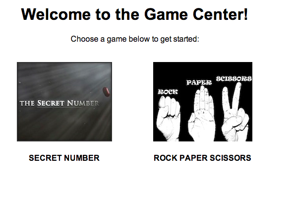

##Rock Paper Scissors

####Time: 60 min

###Activity Type: Pair Programming

####Task Instructions

*	Your Instructor will demo the final app, so you know how it works. 

Here are two screen shots to help you style the views.

*	Add the game Rock Paper Scissors to the "Games on Rails App".

*	Create a rock_paper_scissors_controller.rb similar to the secret number controller.

*	Use params[:id] as the user's throw number

*	Calculate the throw (rock, paper, scissors) based on the throw number (0, 1, 2)

*	Compare the 2! If the user's throw matches the apps throw, the user wins. If both are same, show a tie. Otherwise, show a loss message.

*	__Bonus__: Refactor the application so that it uses the real [rules of rock paper scissors](http://en.wikipedia.org/wiki/Rock-paper-scissors). 

We've provided the [images](images/) folder.

