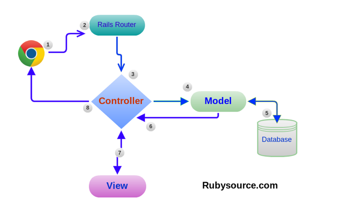
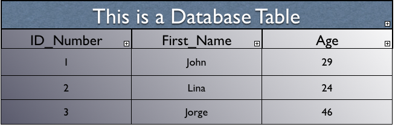

#BEWD - Models & Active Record

###Instructor Name

---


##Agenda
*	Review
	*	Quick Fire - Movies App
*	Models
	*	Databases
	* Generating Models
	*	Migrations
	*	seeds.rb
*	Active Record
*	Lab Time

---


##Review


###Movies App - Quick Fire

####Time: 20min

---


##Review
###Routes, Views and Controllers


---


##Review: MVC
###Model View Controller

*	The controller interacts with the Model
*	The controller renders the view, passing it Model data (using instance variables)
*	The view and the model do not interact (need the controller)



---

##Models
### Talking to the database
* 	Models are needed to talk to the database
* 	We need to use the database to store *persistent* data (lives beyond a request lifecycle)
* 	Models simplify the task of working with a database
* 	Each model is used to talk to a specific table (e.g. User model for Users table)
* 	Rails models have special functionality to allow you to easily lookup data from the table, or make changes without having to use SQL directly*

---


##Database
###Permanent Data


*	Permanent store for data (lives beyond a single request)
*	Designed to handle data at scale (lots of data)
*	Many different databases we can choose from, Rails handles almost all of them.


---

##Database
###Standard data types

* Text
* Numbers
* Dates / Times
* Booleans

---

##Database
###Tables

Table: A database is made up of a collection of tables. Example below is a list of Employees.



---

##Database
###SQL

SQL: Structured Query Language
A programming language used to search and save data to databases.

	SELECT "movies".* FROM "movies" WHERE "movies"."title" = 'Jaws' LIMIT 1

---


##Model
###Code Along: Shirts

Shirt Management app is an application we will build incrementally during class.

The app allows users to manage their T-Shirts collection, by adding and deleting shirts to the database.

For this lesson we will add a basic T-Shirt Model.

---


###Shirt Management

Let's Add a T-Shirt Model.

---


##Recap
###Create a new model


		rails g model Shirt name:string description:text


---

##Recap
###Rake

	rake db:migrate

---

##Recap
###Rake


*	Task runner for ruby
*	Used to:
	*	Run Migrations
	*	Seed your database

---


##Shirt Management

*	Add image field to database (we will create the view next class)
*	Run seeds file

---

##Recap
###Migration

	# defaults
	class AddRatingToMovies < ActiveRecord::Migration
		def change
    		add_column :movies, :rating, :integer, default: 3
    end
  end

---


##Recap
###Migration

* Can add fields / columns to existing tables

		# shortcut Syntax
			rails g migration AddImageToShirts image:string
---


##Migrations
###What can you do in a migration?

* Adding/removing columns from a table
* Modifying columns on a table
* Adding/removing tables

---


##Recap
###Seeds

*	Fast and easy way to add data to your tables
*	Place a `seeds.rb` file into your `db/` folder
*	Run `rake db:seeds`

---


##Shirt Management

*	Rails Console & Active Record
*	CRUD

---


##Recap
###Active Record

Create

	Shirt.create(name: "White Tee")

Read

	Shirt.find_by name: "White Tee"

Update

	my_shirt = Shirt.find_by name: "White Tee"
	my_shirt.update description: "GA white T-Shirt"

Delete

	my_shirt = Shirt.find_by name: "White Tee"
	my_shirt.destroy

---


##Recap
###Active Record

*	Rails has a library called ActiveRecord to help Models talk to the database.
*	Thus, Rails models are called ActiveRecord models.
*	While ActiveRecord makes it easy to avoid SQL almost entirely, it's still valuable to know some SQL. Later in your development path, you will want to know which queries are more/less efficient so you can optimize them.
*	For now though, we can enjoy the super-simple syntax of ActiveRecord to talk to our database.


---

##Models
###Summary
*	We want to store our data in a persistent manner, so we need databases.
*	Communicating with databases in SQL is complex, so we use ActiveRecord models to help us.
*	ActiveRecord models are just Ruby Objects, so we can call methods on them and pass them around like any other object.
*	Each Model *class* maps to a database table
	*	`>> User.all`
	*	`>> User.create first_name: 'Salman'`
	*	`>> User.find(1)`
*	Each Model *instance* maps to a single record in a table in the database
	*	`>> user = User.find(1)`
	*	`=> #<User:0x007fcf8e9eebd8>`
	*	`>> user.id`
	*	`=> 1`
	*	`>> user.update last_name: 'Ansari'`


---

##MVC
###Model View Controller

*	The controller interacts with the Model
*	The controller renders the view, passing it Model data (using instance variables)
*	The view and the model do not interact (need the controller)


---


##MVC
###Controller

*	Controller interacting with the model

__shirts_controller.rb__

		@shirts = Shirts.all #Returns an array of Shirts (array of hashes)

---

##MVC
###Controller

*	Controller intreating with the view

__shirts/index.html.erb__

		#Can be used in the view
		@shirts

---


## Homework

Complete and submit the Movies app - Movie Model(due lesson 11)

Let's start now.

---


##Movie App - Movie Model

---


<div id="resources">

## Resources: Models & Active Record

###Cheat Sheet

####Create Models

```bash
	rails g model ModelName attribute_name:migration_type attribute_2:migration_type
```
*	Use spaces to separate attributes. If you don't list a migration_type (text, integer, float, etc.) the default will be string.

####Migrations

__Migrations__

*	Forgot an attribute / field in your model? Create a migration
	*	Code below adds a field called ratings to the Movies model.

```
	rails g migration AddRatingToMovies rating:integer
```

__Seed Files__

*	Populating an entire database with the console would take a while. Use the seeds.rb file.

```
rake db:seed
```

__Drop The Database__

*	_You will loose your data if you do this._

```
	rake db:drop
```

__Drop database, run migrations, run seeds__

```
	rake db:reset
```

####Active Record

__Create__

	```
		Movie.create(title: "Jaws")
	```

__Read__

	```
		Movie.find_by title: "Jaws"
	```

	```
		# Returns all movie objects in an array.
		Movie.all
	```

__Update__

	```
		jaws = Movie.find_by title: "Jaws"
		jaws.update description: "Big Shark, bites people"
	```

__Delete__

	```
		jaws.destroy
	```


###Still Feel Lost?

At the end of this course you should have an understanding of what databases are and the general structure of a database table (rows and colums). In addition you should be familiar with how to create, update and delete records using active record in the Rails console.

####Catch Up With These Resources

[Introduction to Databases w/ Geekgirls](http://geekgirls.com/2011/09/databases-from-scratch-i-introduction/)

[Introduction to Database Youtube Video](http://www.youtube.com/watch?v=KgiCxe-ZW8o
)

[Rails Guides Active Record Query](http://edgeguides.rubyonrails.org/active_record_querying.html)

[Rails Guides Validations](http://edgeguides.rubyonrails.org/active_record_validations.html)


__Rake__
Rake is Rails software task management tool, often used to automate moving, compiling, and deleting Ruby files

Rake executes tasks defined in rake files which describe tasks to be completed using Ruby anonymous function blocks

[Introduction to using rake](http://guides.rubyonrails.org/command_line.html#rake
)

[User guide to rake](http://docs.rubyrake.org/user_guide/index.html
)
