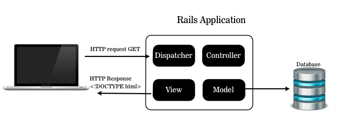
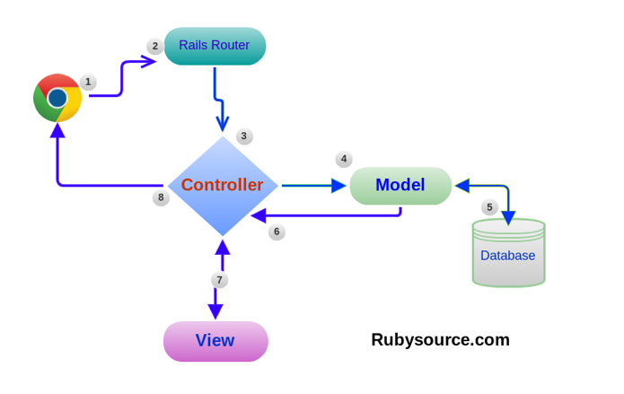

#BEWD - Models & Active Record

###Instructor Name

---


##Agenda
*	Review
	*	Quick Fire - Movies App
* 	Databases
*	Models 
	* 	Generating Models
	*	Migrations	
	*	seeds.rb
*	Active Record 
*	Lab Time

---


##Review
###Routes, Views and Controllers



---


##Movies App

---


##Database
###Data Persistence

Data is gone when we close our app (i.e. Params do not persist after we close the app).
	
*	Saves data, even after we close the app.
*	Databases are made to handle LOTS of data.
*	Perfect for our apps.


---

##Database
###Vocab

Data: What can we save 

*	text
*	images
*	video

---

##Database
###Vocab

Table: A database is made up of a collection of tables. 


---

##Database
###Vocab

SQL: Structured Query Language
A programming language used to search and save data to databases.

	SELECT "movies".* FROM "movies" WHERE "movies"."title" = 'Jaws' LIMIT 1

---

##MVC
###Models & Databases

*	Models are how Rails applications interact with the database.
	*	No SQL required!!!!!	


---

##Model
###Code Along Described

Shirt Management app is an application we will build incrementally during class.

The app allows users to manage their T-Shirts collection, by adding and deleting shirts to the database. 

For this lesson we will add a basic T-Shirt Model.

Demo complete app [here]()

---


###Shirt Management

Let's Add a T-Shirt Model.

---


##Recap
###Create a new model

	
		rails g model Shirt name:string description:text 
	

---

##Recap
###Rake
	
	rake db:migrate  

---

##Recap
###Rake


*	Task runner for ruby
*	Used to:
	*	Run Migrations
	*	Seed your database

---


##Shirt Management

*	Add image field to database (we will create the view next class)
*	Run seeds file

---

##Recap
###Migration

	# defaults
	class AddRatingToMovies < ActiveRecord::Migration 
		def change                                                                       
    		add_column :movies, :rating, :integer, default: 3
    	end 
    end

---


##Recap
###Migration

* Can add fields / columns to existing tables

		# fancy Syntax
			rails g migration AddImageToShirts image:string
---


##Recap
###Migration Types

####string, text, integer, float, decimal, datetime, timestamp, time, date, binary, boolean


---


##Recap
###Seeds

*	Fast and easy way to add data to your tables

	rake db:seeds	

---


##Shirt Management

*	Rails Console & Active Record
*	CRUD

---


##Recap
###Active Record

*	The Active Record pattern represents rows of data as objects
*	All database interaction is managed through ActiveRecord objects, no SQL is required
*	[ActiveRecord is built into Rails]( http://ar.rubyonrails.org/
http://api.rubyonrails.org/classes/ActiveRecord/Base.html)

---


##Recap
###Active Record

Create

	Shirt.create(name: "White Tee")

Read
	
	Shirt.find_by name: "White Tee"

Update

	my_shirt = Shirt.find_by name: "White Tee"
	my_shirt.update description: "GA white T-Shirt"

Delete

	my_shirt = Shirt.find_by name: "White Tee"
	my_shirt.destroy

---


##MVC
###Model View Controller

*	The controller interacts with the model
*	The controller also interacts with the view
*	The view and the model do not interact (need the controller)




---


##MVC
###Controller

*	Controller intreating with the model

__shirts_controller.rb__

		@shirts = Shirts.all #Returns an array of Shirts (array of hashes)

---

##MVC
###Controller

*	Controller intreating with the view

__shirts/index.html.erb__

		#Can be used in the view
		@shirts 

---


## Homework

Complete and submit the movies app (due lesson 11)

Let's start now.

---


##Movie App

Pair program

---


<div id="resources">

## Resources: Models & Active Record

###Cheat Sheet

####Create Models

```bash
	rails g model ModelName attribute_name:migration_type attribute_2:migration_type 
```


*	Use spaces to separate attributes. If you don't list a migration_type (text, integer, float, etc.) the default will be string.




####Migrations

__Migrations__

*	Forgot an attribute / field in your model? Create a migration
	*	Code below adds a field called ratings to the Movies model.

```bash
	rails g migration AddRatingToMovies rating:integer
```

__Seed Files__

*	Populating an entire database with the console would take a while. Use the seeds.rb file.

```bash
rake db:seed
```

__Drop The Database__

*	_You will loose your data if you do this._

```bash
	rake db:drop
```

__Drop database, run migrations, run seeds__

```bash
	rake db:reset
```

####Active Record

__Create__

	```ruby
		Movie.create(title: "Jaws")
	```

__Read__

	```ruby
		Movie.find_by title: "Jaws"
	```
	
	```ruby
		# Returns all movie objects in an array.
		Movie.all
	```

__Update__

	```ruby
		jaws = Movie.find_by title: "Jaws"
		jaws.update description: "Big Shark, bites people"
	```

__Delete__

	```ruby
		jaws.destroy
	```


###Still Feel Lost? 

At the end of this course you should have an understanding of what databases are and the general structure of a database table. In addition you should be familiar with how to create, update and delete records using active record in the Rails console.

####Catch Up With These Resources

[Introduction to Databases w/ Geekgirls](http://geekgirls.com/2011/09/databases-from-scratch-i-introduction/)

[Introduction to Database Youtube Video](http://www.youtube.com/watch?v=KgiCxe-ZW8o
)

[Rails Guides Active Record Query](http://edgeguides.rubyonrails.org/active_record_querying.html)

[Rails Guides Validations](http://edgeguides.rubyonrails.org/active_record_validations.html)


__Rake__

Rake is Rails software task management tool, often used to automate moving, compiling, and deleting Ruby files

Rake executes tasks defined in rake files which describe tasks to be completed using Ruby anonymous function blocks

[Introduction to using rake](http://guides.rubyonrails.org/command_line.html#rake
) 

[User guide to rake](http://docs.rubyrake.org/user_guide/index.html
)


