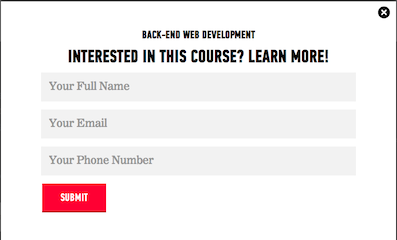

#BEWD - Forms & Validations

###Instructor Name

---


##Agenda

*	Review
*	Forms
	*	Search Forms, Create Forms, Partials
*	Validations
*	Lab Time

---


##Review
###Routes, Model, View, Controller


---


##Review

###Shirts Management App - Review

*	Add controller and view to Shirts App

---

##Forms
###Adding Forms to Views

*	Used to 'GET' user input



---


###Shirts Management App - Search Form

*	As a user I want to be able to search for a specific T-Shirt in my collection.

---

##Recap
###Search Forms

When a user clicks 'Search'

1.  Goes to the Shirts controller index action. 
2.  Sends the query as a querystring parameter (params[:q])
3.  Filters results by the query
4.  Searches shirts by name or description fields


---


##Recap
###Partials

*	File name starts with an underscore
*	Inserted into page using the "render" keyword
*	Have access to instance variables
*	Forms are great candidates for partials
*	Rails magically handles the methods for us if we use model objects

---


##Recap
###Queries

*	Search database with the keywords "where" & "LIKE"
	
		where('name LIKE :query OR description LIKE :query', query: "%#{query}%")	
*	Searches the Shirt table's name and description fields.

---


##Recap
###Refactor

*	Changing the structure of your code without changing behavior
*	Move all complex data queries to the model

---


##Movie App - Search

*	Create a search box that will search for a term in the movie's title, description and the year
*	Create partials for the search box
*	Move all complex data queries to the model

---


##Forms
###Adding to Database

*	We saw how a user can search the database with a form, but how does a user add to the database using forms.

---


###Shirt Management App - Create & Edit Forms

*	As a user I want to add shirts to the database.
*	As a user I want to edit shirts. 

---


##Recap
###REST

*	REpresentational State Transfer

---

##Recap
###REST

*	:resources in the routes file gives us LOTS (7) of routes
*	Perfect for managing "Resources" (Things in your domain, like Shirts and Movies)

---


##Recap
###Form Builders

*	Form Builders are awesome
*	You MUST create an empty object in the controller for the magic to work


``` htmlmixed
<%= form_for @shirt do |f| %>
<% end %>    
```

---


##Recap
###Strong Parameters

*	Rails Controllers require you to whitelist which fields a form can send
*	Used to protect from nasty attacks. Github got bitten by one a while back.

---


##Recap
###Validation

*	Ensures that we are saving accurate information in the database. 
	*	If our validation fails, don't add record to the database table
	*	If our validation fails let the user know it failed.
---


## Recap
### Private methods

*	Not routable, or callable from the outside world

---


##Recap
###Flash

*	Used to send messages to the user
*	Good for letting them know something succeeded
*	Use flash[:notice] and flash[:error]
*	Put checks in the layout to always show messages

---


## Homework

* Movies app due (Lesson 11)

Let's start now.

---


##Movie App

---


<div id="resources">
## Resources: Forms & Validation

###Cheat Sheet

####Reload Code in Console

*	Reloads freshest code in the console

``` ruby
reload!
```

####Validations

__Validate Presence__

*	Validates that title, description and year_released, rating are not empty.
*	
``` ruby
validates :name, :description, presence:true
```

__Validate Length__

*	Validates that all descriptions are a minimum of 10 characters.

``` ruby
validates :description, length: { minimum: 10 } 
```

__Numericality__

``` ruby
validates :year_released, numericality: { only_integer: true }                   
validates :rating, numericality: { greater_than_or_equal_to: 1, less_than_or_equal_to: 5, only_integer: true }
```

__Checks if a record is valid__

``` ruby
movie.valid?
```

__Show current errors in an object__

*	Shows all of the current errors on an object

``` ruby
movie.errors
```


####Strong Parameters

``` ruby
def create                                                                       
  shirt_params = params.require(:shirt).permit(:name, :description, :image)   
  shirt = Shirt.create(shirt_params)                                             
  redirect_to shirt                                                              
end                  
```


#### Private methods

*	Not routable, or callable from the outside world

```ruby 
class MyClass 
	def call_me 
		puts "Called" 
	end 
	private 
	def maybe 
		puts "Forever Alone" 
	end 
end 
```


###Still Feel Lost? 

This course focus was on forms. You should have a general understanding of form builders and what happens when using a search form. Next lesson you will continue to practice Forms, Models, Views, Controller and Routes. 

####Catch Up With These Resources

*	[Form Tags](http://edgeguides.rubyonrails.org/form_helpers.html) about the different tags here and [here](http://api.rubyonrails.org/classes/ActionView/Helpers/FormTagHelper.html)

*	[Form Helpers](http://api.rubyonrails.org/classes/ActionView/Helpers/FormHelper.html)	

