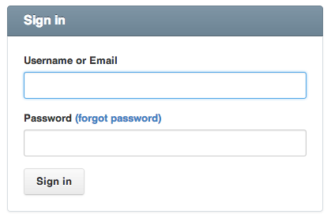

https://github.com/plataformatec/devise#getting-started


#BEWD - Authentication

###Instructor Name


---


##Agenda

*	Review
	*	Rewsly Solution
	*	Rity Solution (Briefly)
*	Authentication
	*	Authentication Explained
	*	Devise Gem
*	Lab
	*	Authenticated Ritly

---


##Review
###Rewsly & Ritly

*	Let's review Rewsly solution from last class.
*	Since we're going to work on Ritly, let's review that (briefly) as well.

---


##Authentication



---


##Authentication

*	Use of a combination of username and password to validate user identity. (Obvious I know…)
*	Tracking a user's identity on our app through the __session__.

---

##Authentication
###Security


---

##Security
*	Can I view users' passwords in my app?

####NO!

---

##Security
###Storing Passwords

Bad practice to keep passwords in “clear text”

*	Passwords can't be stored in plain text in your database.
If your database is compromised then passwords are compromised as well.
	*	Don't use the same password for all sites.

---


##Security
###Hashing

Use one way hash

```
Digest::SHA2.hexdigest("secret")
# => "e5e9fa1ba31ecd1ae84f75caaa474f3a663f05f4"
```
---


##Security
###Adding Salt

Salt is random data that are used as an additional input to a one-way function that hashes a password.


```
salt = "a761ce3a45d97e41840a788495e85a70d1bb3815"
password = "secret"
Digest::SHA2.hexdigest(salt+password)
# =>"7963ca00e2e48ea80c615d037494de00a0964682"
```

---


##Authentication
###Managing Users

*	When the user is authenticated we store the user_id in the __session__.

---


##Managing Users
###Session

*	Session data commonly includes the browser user’s identity (name, login, shopping cart, etc.).

*	To work, the web server must uniquely identify each browser’s particular HTTP requests while the session lasts.

*	Commonly, web servers identify browsers by asking them to store a __cookie__.

---

##Managing Users
###Cookie

*	Used to store small bits of information (maximum size about 4k).
*	Cookies allow web servers to provide a temporary unique ID to a browser, to enable session management.
	*	Browser storage is not secure.
	*	Sensitive data (credit card numbers, etc.) should never be set in a cookie

---


##Authentication
###Gems
Creating authentication from scratch is a complex process (see resources for more info). However Developers have created Gems to make authentication "easy".

*	__Devise__
*	CanCan
*	Clearance
*	OmniAuth
*	DoorKeeper

---


##Authentication
###Devise GEM
[https://github.com/plataformatec/devise](https://github.com/plataformatec/devise)

*	Straight-forward to implement, integrate and customize.
*	Handles complex security, so you don't have to.
*	Provides controller filters and view helpers (more on that in the code along).
* 	Recently updated (v3.0.0) with Rails 4 support!


---


##Rewsly - Adding Devise

---


##Devise
###Recap

*	Adding Devise Gem to the Gemfile

		gem 'devise', '~> 3.0.0'

---


##Devise
###Recap

*	Using Devise

		rails g devise:install # creates all the devise Controllers, views and initializers
		rails g devise user    # creates User model (or modifies it if it exists)
		rake db:migrate        # Let's Go!


---


##Devise
###Recap

*	View helpers

		<%= user_is_logged_in? %>
		<%= current_user %>

---


##Authentication
###Recap

*	View helpers

		<%= user_is_logged_in? %>
		<%= current_user %>

---

##Devise
###Recap

*	Blocking Access

		class ApplicationController ...
			before_action :authenticate_user!
		end

		class HomeController < ApplicationController
			skip_before_action :authenticate_user!
		end

---

##Devise
###Recap

*	Changing the default Route names

		devise_for :users, :path_names => { sign_in: 'login', sign_out: 'logout' }

---


##Lab Time - Authenticated Ritly

---


## Homework

Write a list of information/data you want to store about your user.

---


<div id="resources">
## Resources

###Cheat Sheet

No cheat sheet this class. Remember, Google is your friend!


###Tips, Tricks & Advanced Reading

*	If you want to expand your knowledge about Rails authentication gems visit [Ruby Toolbox](https://www.ruby-toolbox.com/categories/rails_authentication) for a few more authentication gem options.

*	Great [article](http://scientopia.org/blogs/goodmath/2013/03/02/passwords-hashing-and-salt/) explaining passwords, hashing, and salt.


*	Advanced [article](http://edapx.com/2012/04/18/authorization-and-user-management-in-rails/) about authorization and users management in rails.

*	[Tutorial](http://everydayrails.com/2012/07/31/rails-admin-panel-from-scratch.html) on how to create an advanced admin panel.

*	[Authentication From Scratch](http://railscasts.com/episodes/250-authentication-from-scratch) Rails Cast


###Still Feel Lost?
####Catch Up With These Resources

*	[Devise](http://railscasts.com/episodes/209-introducing-devise) Rails Cast

