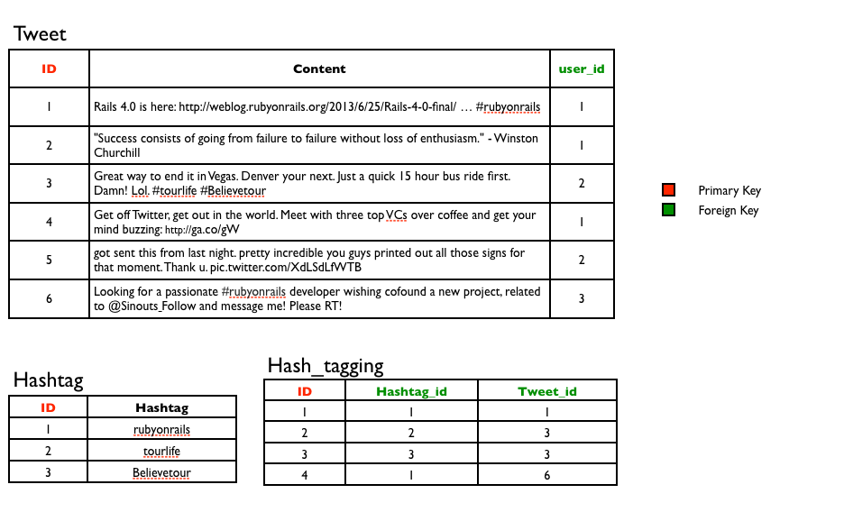

#BEWD - Associations

###Instructor Name


---


##Agenda

*	Finding Associations
*	Coding Associations
*	Nested Forms

---


##Rewsly
###New  Feature

We want to track which user posted a specific story. 
````stories.find_by_user_id()````

…stories does not have a user id.

---


##Associations

Users need to be __associated__ to a story.

---


##Associations
###Definition

Model associations are how models interact with each other. 

Adding associations will help us know which user posted which story. 

With associations its best to step away from the code and understand conceptually what is happening.

---


##Twitter Associations


---


##Associations
###Rails Active Record Associations

__belongs_to__

__has_many__

__has_many :through__

_has_one_

_has_one :through_

_has_and_belongs_to_many_


We will cover the bolded associations.

---

##Associations

User __has_many__ Tweets 

Tweet __belongs_to__ User


---


##Associations

Tweet __has_many__ hash_tags __through__ hash_tagging 




---


##Associations
### Primary Keys

A unique key (field) that can uniquely identify each row in a table


---


##Associations
### Foreign Keys

… a foreign key is a column or a combination of columns that is used to establish and enforce a link between the data in two tables. - __Wikipedia__

---


##Netflix Associations

---

##Associations
### Coding Associations

Now that we know how to identify associations, lets see how to add them in code.


---


##Rewsly

*	We need to add new features to Rewsly.
*	Stories must be associated to users.
*	Users can comment on stories.

---


## Homework

Project Milestone: 

*	List all models needed for your final project. 
*	Draw a diagram to show how they will be associated.

Due lesson 15.

---

<div id="resources">
## Resources

###Cheat Sheet

No cheat sheet this class. Remember, Google is your friend!


###Tips, Tricks & Advanced Reading

*	[Implementing users and followers relationship](http://blog.teamtreehouse.com/what-is-a-has_many-through-association-in-ruby-on-rails-treehouse-quick-tip) 

*	[Rails Naming Conventions](http://itsignals.cascadia.com.au/?p=7)

*	What's The Difference Between has_one and belongs_to - [Stack overflow](http://stackoverflow.com/questions/3808926/whats-the-difference-between-belongs-to-and-has-one belongs_to vs has_one)

*	Advanced Rails Forms and nested attributes - [tutorial](http://rubysource.com/complex-rails-forms-with-nested-attributes/)

http://api.rubyonrails.org/classes/ActiveRecord/NestedAttributes/ClassMethods.html


###Still Feel Lost? 
####Catch Up With These Resources

*	[Michael Hartl Chapter 10](http://ruby.railstutorial.org/chapters/user-microposts#top)


*	[Associations Tutorial](http://net.tutsplus.com/tutorials/ruby/active-record-the-rails-database-bridge/) 


*	[Rails Guides - Associations](http://guides.rubyonrails.org/association_basics.html)


*	[Differences in primary and foreign keys](http://www.programmerinterview.com/index.php/database-sql/differences-between-primary-and-foreign-keys/ Primary and Foreign keys)
