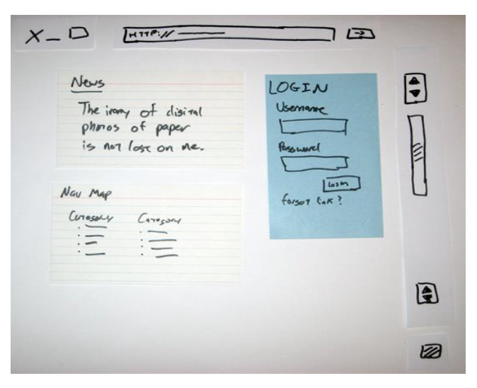

#BEWD - Final Project: Getting Started

###Instructor Name

---

##Agenda

*	Plan Your App
*	User Stories
*	Wireframes / Paper Prototype
*	User Testing
*	Database Schema

---

##Plan Your App
###Before you code

We are going to borrow some best practices from project managers and UX designers to help us plan our final project.

*	Planning before code will help prevent uniformed (and expensive) decisions.
*	Thinking deeply about how you want your app to function will help provide direction.
*	Visualizing your application flow will simplify implementation.

---

##User Stories

	As a user, I want to take a photo of where I am and share it with the world. - Simple User Story for Instagram.

*	User stories are used with agile software development methodologies as the basis for defining the functions a business system must provide, and to facilitate requirements management. 
*	A user story captures the 'who', 'what' and 'why' of a requirement in a simple, concise way, often limited in detail by what can be hand-written on a small paper notecard. 
*	User stories are written from the perspective of the user (a regular user, admin user, or otherwise), not the developer.

---

##User Stories
###How we will use them

*	We are going to write user stories to help define what functionality we need to build. 
*	We can also use them to determine what functionality we will build during this course and what we will build beyond BEWD.
*	In addition, we will create paper prototype for our web applications and diagram the database schema from our user stories.

---

##User Stories
###Basic Rules

This is the user story template: 

	“As a __<type of user>__, when I __<perform some action>__ then I should see __<something happen>__.” 

Example User Story for Amazon:

*	_“As an Amazon user, when I add a movie to my Amazon Wish List, then I should see the movie when I visit my Wish List page.”_
*	_“As an Amazon user, when I add a movie to my Amazon Wish List, and click 'Share to Facebook', then my Facebook friends should see a story about the event in their Facebook newsfeed.”_*	

---

##User Stories

---

##Wireframes and Paper Prototypes
###Definition

Wireframes are a key tool in communicating the content and layout of a web page. They are simple mock ups showcasing how the site will look. Some will use digital tools to create wireframes, others will draw them on paper.

They can be used by:

*	Project Managers to review plans with stakeholders
*	Programmers to develop functionality
*	Graphic designers to produce designs

---

##Wireframes and Paper Prototypes
###Simple, Quick and Easy

---

##Wireframes and Paper Prototypes
###Simple, Quick and Easy

---

##Wireframes

---

##Wireframes and Paper Prototypes
###How we will use them

*	We are going to create simple prototypes using pen and paper. This is the fastest way to test your ideas.
*	However, doing so enables you to seek out the help of others to test your application, rather than just reviewing it yourself…
*	One methodology to solicit feedback for your app is User Testing.

---

##User Testing
###Definition

A simple method to evaluate a product by testing out a sample of the user experience on users. 

---

##User Testing
###How we will use it

During this class we will use our paper prototypes and test our ideas and layouts. This will help us define and scope functionality.

---

##User Testing
###How it Works

*	Your tester will use your paper prototype as if it were a real web application. 
*	Ask them to speak their thoughts aloud as they are testing. 
*	Take notes about what they find confusing, and make changes after you've tested all users.
*	The experts say you only have to test 5 people to find 95% of the problems with your design. 

---

##User Testing
###Advanced Example

##### Hanmail Paper Prototype: [https://www.youtube.com/embed/GrV2SZuRPv0](https://www.youtube.com/embed/GrV2SZuRPv0)

<iframe width="420" height="315" src="http://www.youtube.com/embed/GrV2SZuRPv0" frameborder="0" allowfullscreen></iframe>

---

## Homework

###Project Milestone
####Due lesson 15.

*	At least 5 User Stories.
*	Diagram of Database Schema (Models, attributes for those models, associations.)

---

##Rapid Prototype You App

*	Write User Stories (Time 20min)
*	Wireframe / Paper Prototype (Time 30min)
*	User Testing (Time 20min)
*	Database Schema (time 45 min)

---

## Resources

###Cheat Sheet

No cheat sheet this class. Remember, Google is your friend!

###Tips, Tricks & Advanced Reading

__How To Start__

*	How to start a Rails app Stack-Over Flow [discussion](http://stackoverflow.com/questions/1594010/how-do-you-plan-your-rails-app)

__User Stories__

*	User story [template](http://www.mountaingoatsoftware.com/blog/advantages-of-the-as-a-user-i-want-user-story-template)

*	Mike Cohn User Stories [Chapter](http://www.mountaingoatsoftware.com/system/asset/file/259/User-Stories-Applied-Mike-Cohn.pdf)

Why user stories make sense [article](http://agile.dzone.com/articles/why-user-stories-make-sense?mz=123873-agile)

__Wireframe & Paper Prototypes__

*	Prototyping [Tutorial](http://www.usabilitynet.org/tools/prototyping.htm)

*	Wireframing [Tutorial](http://webdesign.tutsplus.com/tutorials/workflow-tutorials/a-beginners-guide-to-wireframing/)
	
*	Wireframe [Definition](http://web2usability.wordpress.com/2009/01/07/definition-usage-wireframe/)

