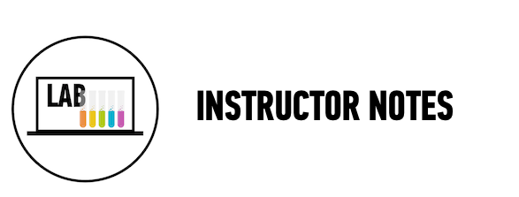

##[Museum App](starter_code/)

####Time: 120 min

| | |
|------------- |:-------------|
| __Topics__ | MVC, Associations| 
| __Description__|Practice planning and building a Rails application.|
| __Activity Type__|Pair programming |

####Instructional Design Notes

*	Students will plan and build a Museum Application. We will provide user stories and students will use them to plan and build.
