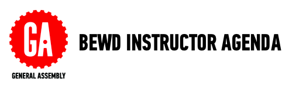

##Lesson 16: Finishing Touches

###Learning Objectives

*	Utilize front-end frameworks to style an app
*	Deploy a project to Heroku
 
Note: This lesson demonstrates front-end templates using Twitter Bootstrap, instructors can use a different template if they prefer.

###Schedule

| Time        | Topic| GA ICLs| Comments |
| ------------- |:-------------|:-------------------|:-------------------|
| 60 min | Review Session| ex [Stuff Finder - Build](instr_exercise_notes.md) |Students practice Rails skills, by building an online classified application, similar to Craigslist. | 
| 30 min | Front-End frameworks| code demo [Stuff Finder - Styled](instr_code_demo_notes.md) | As a class explore integrating front-end templates and how to read twitter bootstrap documentation | 
| 30 min | Heroku |code demo [Stuff Finder - Heroku](instr_code_demo_notes.md) | | 
| 60 min | Lab Time | ex [Stuff Finder - style & push changes](instr_code_demo_notes.md) | Students continue to style Stuff Finder and push changes to Heroku. They can also work on the final project.| 

###Homework

Students should continue to work on final project

###What's Due? 

Nothing

