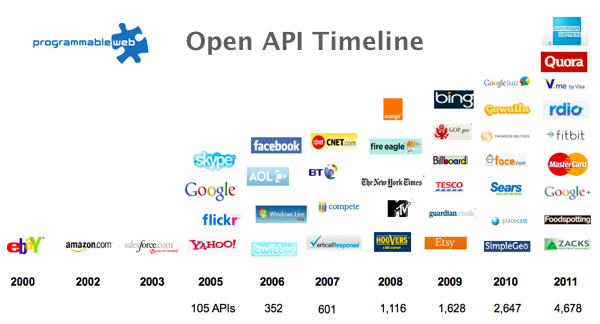
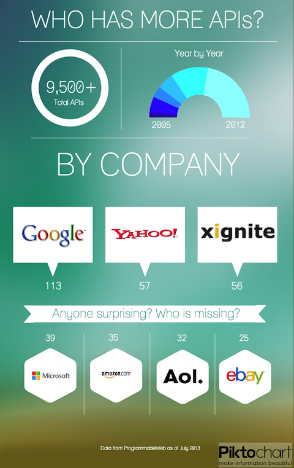

#BEWD - Third Party APIs

###Instructor Name

---

##Agenda

*	APIs & Rails

---

##API
### Application Programming Interface

*	We've worked with APIs before!
	*	Ruby (Mashable, Reddit, Digg)
	*	OAuth with Twitter
---

##API
###Protected APIs - OAuth

*	Require an API key
*	Give your app access to resources
*	Give your users permission to delegate rights to your application

---

##API
###Public APIs - Mashable, Reddit Digg

*	Don't require a key
*	May have limist on number of request
*	Limit what you can do. Anything beyond reading.

---

##API
###Protected APIs

*	Require an API key
*	Identify you as a user in the system
*	Grant you rights based on that key

---

##API
###Popularity

*	There are lots of companies with APIs

---

##API
###Popularity

*	Comanies also have lots of APIs

---

##API
###How do I use them all?

---

##API
###Documentation

*	Reading API documentation is a skill, it takes practice. Don't feel overwhelmed if everything doesn't click right away.

*	How to read API documentation articles are available in the resources section.

---

##Protected APIs

---

## Homework

####The countdown is on!
####2 lessons left!

Continue to work on your final project.
 
---

## Resources

###Tips, Tricks & Advanced Reading

__How To Read API Documentation:__

*	More Practice Understanding API Documentation [article](http://www.chryswu.com/blog/2011/07/12/more-practice-understanding-api-documentation/)

*	Beginners Guide For Journalists Who Want To Understand api Documentation [article](http://www.poynter.org/how-tos/digital-strategies/138211/beginners-guide-for-journalists-who-want-to-understand-api-documentation/
)

__Other__

*	What is Rest [article](http://www.restapitutorial.com/lessons/whatisrest.html)
*	[Infographic](http://blog.programmableweb.com/2013/07/12/infographic-companies-with-the-most-apis/) of the most popular APIs (2013)
*	[Article](http://blog.programmableweb.com/2012/01/04/over-2000-apis-added-in-2011-social-telephony-open-government/) about APIs in 2011.
*	Programmable Web APi [Directory](http://www.programmableweb.com/apis/directory/1?sort=date)
*	[How Does Twillio Free Trial Work?](http://www.twilio.com/help/faq/twilio-basics/how-does-twilios-free-trial-work)

*	Twillio SMS [Tutorial](http://www.twilio.com/blog/2012/02/adding-twilio-sms-messaging-to-your-rails-app.html)
