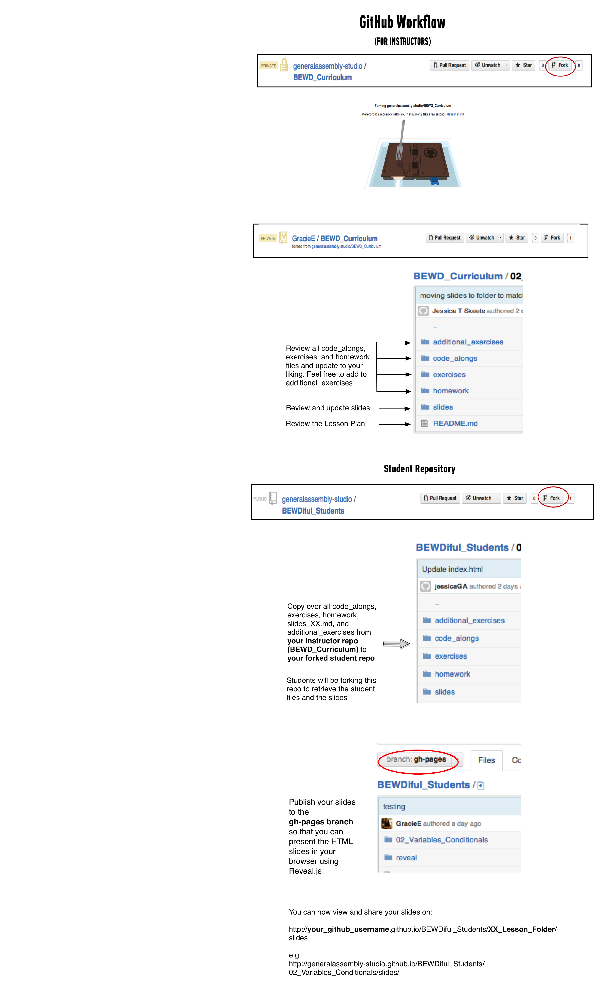

Back-End Web Development
============================

General Assembly's Back-End Web Development course (BEWD) is made up of 20 classes that are 3 hours each. 
The first 6 classes cover Ruby Basics and the following 14 cover Ruby on Rails.

TERMINOLOGY
--------

|Term|Description|
|---|---|
|Course|Refers to all 20 classes which make up the BEWD curriculum|
|Lesson |One 3 hour session of the course. |
|In Class Lab (ICL)|Exercise files that are to be used in class as examples and practice.|
|Code Along|ICLs where students follow along as the instructor completes code.|
|Exercise |ICLs to be completed without instructor guidance.|
|Quick Fire| A programming challenge students must complete in class. aprox 30 min|
|Quiz|3-5 questions based on the material from the previous class. To be completed aloud.|
|Homework|Exercise files that are to be completed at home and reviewed during class.|
|Final Project|The personal project each student will submit and present during the last class.|

SYLLABUS
---------
RUBY BASICS

1.	[Set Up](01_Setup/)
2.	[Variables Conditionals and Methods](02_Variables_Conditionals)
3.	[Collections and Loops](03_Collections_Loops)
4.	[Collections and APIs](04_Collections_APIs)
5.	[Classes and Objects](05_Classes_Objects)
6.	[Sharing Behavior](06_Sharing_Behaviour)

RUBY ON RAILS

7.	[My First Rails App](07_First_Rails_App)
8.	[Routes Views Controllers](08_routes_cont_views)
9.	
10.	
11.	
12.	
13.	
14.	
15.	
16.	
17. 
18.	
19.	
20. Project Presentations

MATERIALS
--------
Each lesson folder includes: 

*	Additional Exercises
*	Code Alongs
*	Exercises
*	Homework
*	Slides / student handout
*	Lesson guide (Readme.md)

In addition there is a [student repo](https://github.com/generalassembly-studio/BEWDiful_Students) (aka. BEWDiful Student Repo) for your course.

Your final materials will go here to be shared with the class. 

SLIDES
-----

We are using reveal.js with markdown 
See [here](https://github.com/hakimel/reveal.js) for further documentation.

You can choose another presentation tool.

	
PREPARING FOR CLASS
--------

1.	Review exercises, code alongs and homework.
2.	Read the slide deck. If using the slide deck __customize the deck before sharing with the class.__
3.	Decide how you will bring your expertise to the classroom.
4.	If not using the GA suggested in class labs, look through additional exercises folder and choose one. Still not satisfied, create your own and make sure it hits the same topics and learning objectives.
5.	Post your personalized materials to your course repo.
6.	Made an excellent change? Fork branch, create a pull request. We love suggested updates!
	

	
GRADING
--------
In order to pass this course General Assembly students must:

*	Complete and submit 80% of all course homework assignments. 
	*	Students will receive feedback from instructors on their assignments within 2 - 4 days. 
	

*	Complete and submit the course project (which may include a presentation), earning 	proficiency. 
	*	Course projects will be assessed based on the course project rubric, which all students will receive early in the course. 
	

QUESTIONS
---------
If you have any questions please send them to [Jessica Skeete](jessicat@generalassemb.ly)

