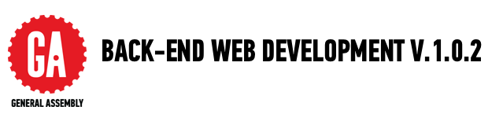

##GETTING STARTED WITH CURRICULUM

Welcome to the BEWD Curriculum v. 1.0.2. 

This repository contains all the materials GA supplies its Back-End Web Development instructors. 

General Assembly's Back-End Web Development (BEWD) course is made up of 20 lessons that are 3 hours each. The first 6 classes cover Ruby Basics and the following 14 cover Ruby on Rails. 

###Before The Course Responsibilities
 
We __highly recommend__ you begin preparing your lessons before the course starts. You should start prepping to teach the materials 4 - 6 weeks prior to course launch. A good bench mark is to prepare the Ruby section (lesson 1 - 6 )  before the course begins. 

During these preparation weeks you should: 

*	Update slides for each lesson.

*	Review solutions and make sure you agree with the way it was coded. Keep in mind students coding level, but don't share code you don't agree with.

*	Review all curriculum materials and think about how you would like to apply your teaching style to the classroom. 

##AVAILABLE MATERIALS

We've supplied a folder for each lesson. In these folders we've included:

|Materials | Description | How to Use It|
|----|---------|---------------|
| __README.md__| Topic break down and suggested schedule. | Use this to get a high level view of the course.|
| __Slides__| Markdown file with slide content.| Customized the deck before sharing with students in GitHub. Use [reveal.js]() to present to the class . Keep the same folder structure so that image relative paths still work.|
| __Code Demo__ / __Code Along__| Code to be used by instructors to help demonstrate a concept.|Type slowly and explain the concepts while students follow along with code and type their notes. Every code demo has an instructor file and student file.|
| __instr_code_demo_notes.md__| Notes from the curriculum team about how to use a particular code demo / code along.| As we gain feedback from instructors and students, we've become aware of student pain points for students. This document contains notes to help you deliver the best course.|
| __Exercises__|Code examples to be completed without instructor guidance.| You should read the instructions and solution files. You must be able to further explain content to students.|
| __instr_exercise_notes.md__| Notes about how to conduct in class exercises.|Similar to the code demo notes, this documents helps you understand how to execute in class exercises|
| __Starter Code Folder__| This is a folder with all the starter code students need for that class.| You should share this folder with students before every lesson.|
| __Solution Folder__| This is a folder with all solution code to code demos and exercises| Share individual solution files as needed. Student should have code demo solutions before lab time to use as a reference.|
| __Quick Fire__| A programming challenge students must complete in class. aprox 30 min - 1 hour| Some lessons will have a quick fire exercise. Quick fire are meant to be done individually and test the students understanding of the content thus far.|

###How To Prepare For Each Lesson
We will provide a __private repository__ for your course. This is how you will share code files, notes and slides with students. 
Students will fork your repository and use the fork as their class repo.

1.	Read the instructor agenda in the lesson folder.

2.	Read the instructor code demo and exercise notes. Become familiar with what we would like students to accomplish.

3.	View the solution file, and make sure you agree with the solutions. If you don't, change it before you share with students. Students want to feel like you are in command of all materials you share with them.

4.	Decide how you will bring your expertise to the classroom.

5.	__Customize the deck before sharing with the class.__ The slides_xx.md files we provide is a base. You need to update it and make sure it fits the story you want to tell. If you prefer not to use slides, use the markdown file to help you plan the story you will tell this class.

6.	If not using the GA suggested in class labs, create your own and make sure it hits the same topics and learning objectives for that lesson. In the next iteration we will provide an exercise bank.

7.	Post your personalized materials to your course repo.

8.	Practice using reveal.js.

8.	Made an excellent change? Make note and let us know.

###Slides

*	We suggest using reveal.js with external markdown. One of our BEWD instructors, Joe Leo wrote a [skeleton framework](https://github.com/jleo3/reveal.ga) for working with BEWD and a locally running reveal.js server. An instructor can start with this and then bring his/her slides over from the BEWD curriculum repo.

*	See [here](https://github.com/hakimel/reveal.js) for further documentation about Reveal.js. 

The slides are a skeletal deck and require your input! If there are slides you do not agree with then update them. If you want to introduce topics in a different order, then reorder them. 

##GRADING

In order to pass this course General Assembly students must:

*	Complete and submit 80% of all course homework assignments. 
	*	Students will receive feedback from instructors on their assignments within 2 - 4 days. 
	

*	Complete and submit the course project (which may include a presentation), earning 	proficiency. See [rubric](final_project_rubric.md). 

##MORE TERMINOLOGY

|Term|Description|
|---|---|
|Course|Refers to all 20 classes which make up the BEWD curriculum|
| __Lesson__ |One 3 hour session of the course. |
| __In Class Lab (ICL)__|Exercise files that are to be used in class as examples and practice.|
|[Final Project](Final_Project/final_project_requirements.md)|The personal project each student will submit and present. Share the project requirements as early as possible.|
	

##QUESTIONS

If you have any questions please send them to [Jessica Skeete](jessicat@generalassemb.ly)

